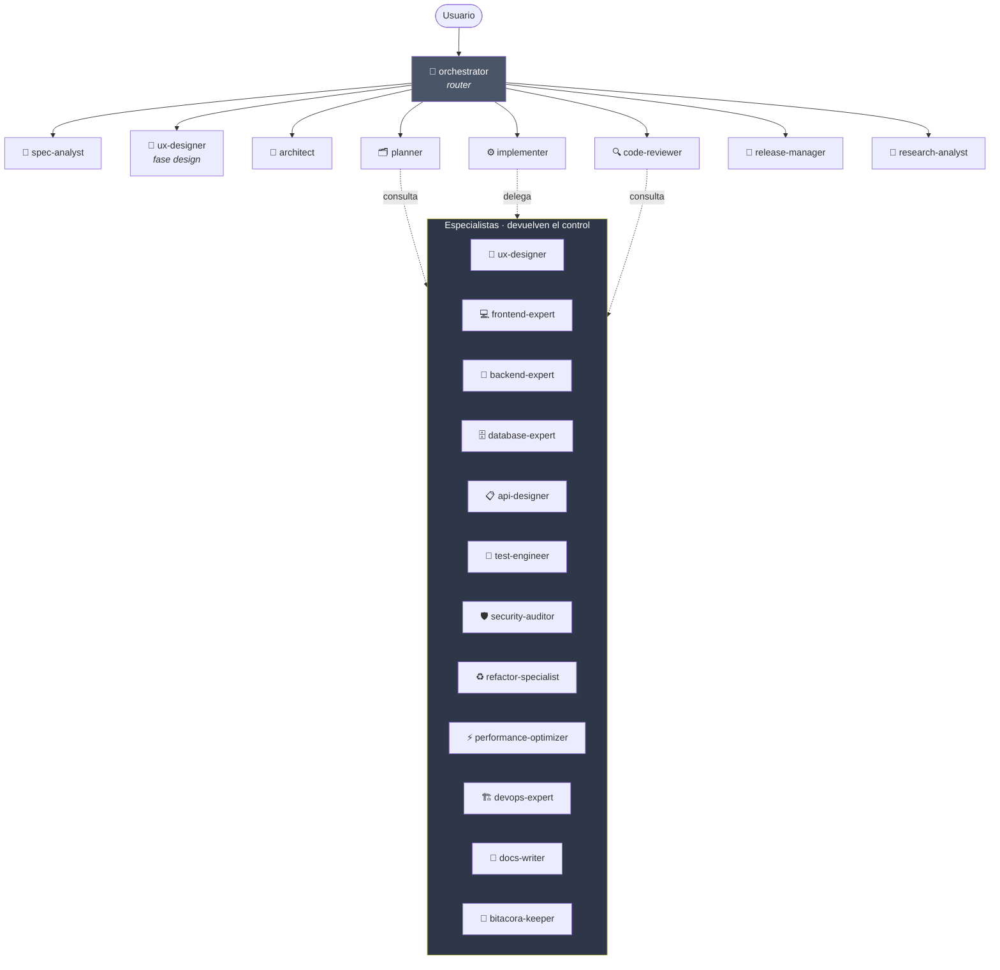
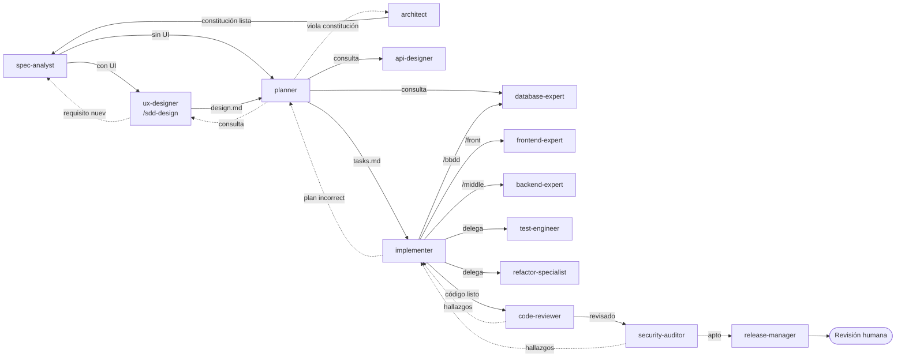

# Catálogo de agentes

20 agentes en tres niveles y 26 skills. Definición canónica en
[`.claude/agents/`](../../.claude/agents/), con adaptadores para GitHub/VS Code, Cursor, Codex,
Gemini CLI y Antigravity.

El historial de diseño que originó este reparto pertenece a la plantilla y no se instala en los
proyectos destino; este catálogo es el contrato operativo portable.

---

## Jerarquía



**Modelo híbrido**: el `orchestrator` es el router por defecto, pero los agentes de fase
conocen su sucesor natural y hacen handoff explícito. Los especialistas **nunca encadenan**
por su cuenta: hacen su trabajo y devuelven el control.

**Profundidad máxima de delegación: 2 niveles**, contando saltos entre agentes —tú no cuentas—:
`orchestrator` → agente de fase → especialista. Ahí se acaba.

---

## Nivel 0 · Orquestación

| Agente | Cuándo | Modelo | Produce |
|---|---|---|---|
| [`orchestrator`](../../.claude/agents/orchestrator.md) | Petición nueva sin clasificar, o no sabes qué agente usar | `opus` | Diagnóstico + enrutado |

## Nivel 1 · Fases del circuito SDD

| Agente | Fase | Modelo | Produce | Handoff natural |
|---|---|---|---|---|
| [`spec-analyst`](../../.claude/agents/spec-analyst.md) | intake · specify · clarify | `opus` | baseline de producto, `spec.md`, `clarifications.md` | → `orchestrator` durante intake; después `ux-designer` o `planner` |
| [`ux-designer`](../../.claude/agents/ux-designer.md) | consulta de intake · **design** | `inherit` | `INTAKE-REVIEW.md`, `design.md`, flujos, estados | → `orchestrator` durante intake; después `planner` |
| [`architect`](../../.claude/agents/architect.md) | init · decisiones estructurales | `opus` | `constitution.md`, ADR | → `spec-analyst` o `planner` |
| [`planner`](../../.claude/agents/planner.md) | plan · tasks | `opus` | `plan.md`, `data-model.md`, `contracts/`, `tasks.md` | → `implementer` |
| [`implementer`](../../.claude/agents/implementer.md) | implement | `inherit` | Código + tests | → `code-reviewer` |
| [`code-reviewer`](../../.claude/agents/code-reviewer.md) | verify | `opus` | Veredicto + hallazgos | → `security-auditor` o `implementer` |
| [`release-manager`](../../.claude/agents/release-manager.md) | ship | `opus` | PR, CHANGELOG, plan de reversión | → humano |
| [`research-analyst`](../../.claude/agents/research-analyst.md) | onboarding · triage · evaluación · refresh | `inherit` | `CURRENT-STATE.md`, diagnósticos, baselines | → quien lo llamó |

## Nivel 2 · Especialistas

La columna **skill** es el procedimiento escrito del especialista: puertas de entrada, ciclo TDD,
patrones y lista de comprobación. Un agente al que solo le dices "aplica SOLID" no aplica SOLID.

| Agente | Terreno | Skill | Modelo | MCP |
|---|---|---|---|---|
| [`ux-designer`](../../.claude/agents/ux-designer.md) | Flujos, wireframes, design system, accesibilidad | [`/sdd-design`](../../.agents/skills/sdd-design/SKILL.md) | `inherit` | `figma`, `stitch` |
| [`frontend-expert`](../../.claude/agents/frontend-expert.md) | Componentes, estado, rendimiento de UI, a11y | [`/front`](../../.agents/skills/front/SKILL.md) | `inherit` | `figma`, `context7` |
| [`backend-expert`](../../.claude/agents/backend-expert.md) | Dominio, casos de uso, integraciones, colas | [`/middle`](../../.agents/skills/middle/SKILL.md) | `inherit` | `context7` |
| [`database-expert`](../../.claude/agents/database-expert.md) | Modelado, migraciones, índices, RLS | [`/bbdd`](../../.agents/skills/bbdd/SKILL.md) | `inherit` | `supabase`, `context7` |
| [`api-designer`](../../.claude/agents/api-designer.md) | Contratos REST/GraphQL/eventos, versionado | — | `inherit` | `context7` |
| [`test-engineer`](../../.claude/agents/test-engineer.md) | Estrategia de test, tests difíciles, auditoría de suite | [`/tdd`](../../.agents/skills/tdd/SKILL.md) | `inherit` | `playwright` |
| [`security-auditor`](../../.claude/agents/security-auditor.md) | OWASP, ASVS, Agentic | [`/security-scan`](../../.agents/skills/security-scan/SKILL.md) | `opus` | — |
| [`refactor-specialist`](../../.claude/agents/refactor-specialist.md) | SOLID, DRY, KISS, YAGNI, patrones | — | `opus` | — |
| [`performance-optimizer`](../../.claude/agents/performance-optimizer.md) | Latencia, memoria, bundle, consultas | — | `inherit` | — |
| [`devops-expert`](../../.claude/agents/devops-expert.md) | CI/CD, contenedores, IaC, observabilidad | — | `inherit` | — |
| [`docs-writer`](../../.claude/agents/docs-writer.md) | README, guías, API para consumidores y baseline documental | [`/docs-sync`](../../.agents/skills/docs-sync/SKILL.md) | `haiku` | — |
| [`bitacora-keeper`](../../.claude/agents/bitacora-keeper.md) | Memoria del proyecto, decisiones, deuda | [`/bitacora`](../../.agents/skills/bitacora/SKILL.md) | `haiku` | — |

---

## Protocolo de handoff

Todo agente cierra con:

```
### HANDOFF
- Agente origen: <nombre>
- Fase completada: <fase SDD>
- Artefactos: <rutas>
- Decisiones tomadas: <lista, o "ninguna">
- Bloqueos / supuestos: <lista, o "ninguno">
- Siguiente agente sugerido: <nombre> — motivo: <por qué>
- Contexto que necesita: <mínimo imprescindible>
```

### Reglas duras

1. Un agente **no salta fases** del circuito SDD.
2. Un agente **no modifica artefactos de una fase anterior** sin avisar y registrar.
3. Ante ambigüedad que cambie materialmente el resultado → **pregunta al humano**.
4. Profundidad máxima de delegación: **2 niveles**, contando saltos entre agentes. El humano no
   cuenta: `Tú → orchestrator → implementer → backend-expert` **es exactamente el máximo**.
   Que el `backend-expert` llamara a otro sería el nivel 3.
5. Los especialistas **devuelven el control** a quien los invocó; no encadenan.
6. Un agente **no escribe en el territorio de otro**.

### Y lo que impide saltárselas

Las reglas de arriba son texto. Esto es lo que las sostiene:

| Quién puede delegar | En quién |
|---|---|
| `orchestrator` | los agentes de fase (no los especialistas) |
| `planner` | `api-designer` · `database-expert` · `ux-designer` · `research-analyst` · `architect` |
| `implementer` | `backend-expert` · `frontend-expert` · `database-expert` · `test-engineer` · `refactor-specialist` · `api-designer` |
| **los otros 17** | **nadie**: no tienen la herramienta |

| Quién no puede escribir | Por qué |
|---|---|
| `orchestrator` | enruta y delega; si pudiera programar, programaría |
| `code-reviewer` · `security-auditor` | quien juzga no arregla: arreglar lo que auditas es auditarte a ti mismo |
| `research-analyst` | investiga y responde |

Y el reparto de rutas está en [`.sdd/territories.json`](../../.sdd/territories.json), que impone
`guard-write.mjs` cruzando el agente activo con el fichero que intenta escribir.
Ver [`AGENTS.md`](../../AGENTS.md) §10.2 y la matriz por IDE en
[`IDE-COMPATIBILITY.md`](../integrations/IDE-COMPATIBILITY.md) §3 bis.

---

## Quién llama a quién



Las flechas de puntos son **caminos de vuelta**: cuando algo falla, se retrocede a la fase
que lo puede arreglar. Nunca se parchea hacia adelante.

---

## Cómo invocarlos

| Herramienta | Forma |
|---|---|
| **Claude Code** | `@nombre-agente` o deja que el `orchestrator` delegue |
| **VS Code (Copilot)** | Picker de agentes del chat. Lee `.claude/agents/` y `.github/agents/` |
| **Copilot CLI / nube** | `.github/agents/*.agent.md` |
| **Cursor** | Referencia el fichero del perfil: `@.claude/agents/architect.md` |
| **Antigravity** | Los workflows de `.agents/workflows/` indican qué perfil adoptar en cada paso |
| **Codex** | Pide el rol por nombre; `.codex/agents/*.toml` lo registra y remite al perfil canónico |

---

## Modelos sugeridos

| Tipo de trabajo | Modelo | Por qué |
|---|---|---|
| Arquitectura, specs, planificación, revisión, seguridad | `opus` | Razonamiento y criterio |
| Implementación, tests, especialistas de dominio | `inherit` / `sonnet` | Volumen y velocidad |
| Búsqueda, formateo, bitácora, tareas mecánicas | `haiku` | Coste |
