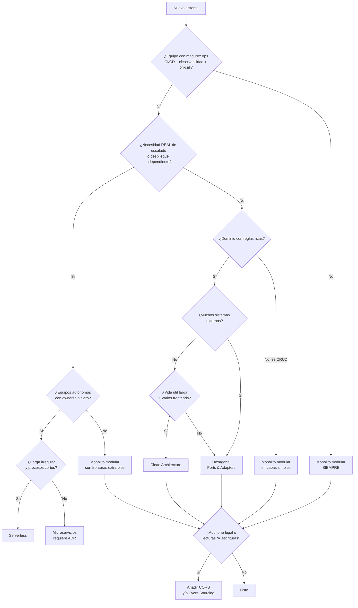

# Guía de decisión arquitectónica

Herramienta del agente `architect`. Se recorre **entera** antes de elegir nada.

---

## 1. Preguntas previas

Sin respuesta a estas ocho, no hay decisión posible, solo preferencia personal.

| # | Pregunta | Por qué importa |
|---|---|---|
| 1 | ¿CRUD o reglas de negocio ricas? ¿Cuántos contextos acotados? | Determina si merece la pena separar dominio de infraestructura |
| 2 | ¿Tamaño y experiencia del equipo? ¿Quién opera esto a las 3 AM? | Una arquitectura que el equipo no domina es peor que una simple |
| 3 | Escala: concurrencia, volumen, ratio lectura/escritura, picos | Distingue el escalado real del imaginario |
| 4 | ¿Tolera consistencia eventual? ¿Hay transacciones críticas? | Puerta de entrada a lo distribuido |
| 5 | ¿Cuántos sistemas externos? ¿Síncronos o asíncronos? | Justifica puertos y ACL |
| 6 | Restricciones: presupuesto, cloud, on-premise, normativa | Elimina opciones antes de evaluarlas |
| 7 | Horizonte: MVP a validar o sistema a 5 años | Cambia por completo el coste aceptable |
| 8 | Madurez ops: ¿CI/CD, observabilidad, on-call? | **Bloqueante** para cualquier cosa distribuida |

---

## 2. Ejes, no etiquetas excluyentes

**Este es el error más común al elegir arquitectura**: tratar "clean", "hexagonal",
"monolito" y "microservicios" como si fueran opciones del mismo menú. No lo son.
Describen **dimensiones distintas** y se combinan.

**Macro arquitectura** — cómo se descompone el sistema:

| Eje | Opciones | La pregunta que responde |
|---|---|---|
| **Despliegue** | monolito · web+worker · servicios · serverless · edge | ¿Qué necesita desplegarse, escalar o fallar por separado? |
| **Dependencias** | layered · hexagonal · clean/onion | ¿Cómo aislamos la política del detalle volátil? |
| **Dominio** | módulos · bounded contexts · servicios | ¿Dónde cambian el lenguaje, las reglas y la propiedad? |
| **Integración** | llamada directa · cola · evento · stream · batch | ¿Qué latencia y acoplamiento admite el proceso? |
| **Datos** | compartidos/propios · ACID/eventual · OLTP/OLAP | ¿Quién posee cada hecho y qué consistencia exige? |
| **Experiencia** | SSR · SPA · móvil · desktop · microfrontend | ¿Qué composición optimiza usuario, equipo y operación? |

**Micro arquitectura** — cómo se organiza el código dentro de una frontera ya decidida:

| Eje | Opciones | La pregunta que responde |
|---|---|---|
| **Organización interna** | por capas técnicas · **vertical slice** (por feature) | ¿Qué ficheros se tocan juntos cuando cambia una cosa? |

Este eje se decide **después** de fijar las fronteras, y **por módulo, no para todo el sistema**.
El monolito modular responde a la pregunta macro (dónde están las fronteras); el vertical slice, a
la micro (cómo se ordena el código dentro de una). No compiten. El módulo de facturación puede ir
por vertical slice y el de notificaciones por capas, y las dos decisiones son correctas si cada
una se justifica.

Una decisión real suena así:

> *Monolito modular* (despliegue) con *fronteras hexagonales* (dependencias) sobre
> *bounded contexts* (dominio), integración *síncrona* salvo notificaciones por *evento*,
> datos *propios por contexto* con *ACID* dentro de cada uno, frontend *SSR*, y por dentro
> *vertical slice* en los contextos con muchas features independientes.

Eso son siete decisiones, no una. Cada una se justifica por separado y **cada una se puede
revisar sin tocar las demás**. Preguntar "¿hacemos clean o microservicios?" es como preguntar
"¿el coche lo hacemos rojo o diésel?".

Consecuencia práctica: la constitución no declara *una* arquitectura, declara **una posición
por eje**. El árbol de abajo te lleva al punto de partida; los ejes te dicen qué has decidido
realmente.

---

## 3. Árbol de decisión

---

## 4. Familias por eje (catálogo comparado)

| Arquitectura | Elígela cuando | Coste real | Descártala si |
|---|---|---|---|
| **Monolito modular** | Default. Equipo ≤ 8, dominio en descubrimiento, time-to-market corto | Bajo. Riesgo: big ball of mud sin disciplina de módulos | Necesitas escalado o despliegue independiente **real** |
| **Hexagonal / Ports & Adapters** | Lógica rica, muchos externos, quieres testear sin infraestructura | Medio: más ficheros, más indirección | Es un CRUD fino |
| **Clean / Onion** | Dominio complejo + vida larga + varios frontends | Medio-alto. Capas vacías si el dominio es pobre | El equipo no lo domina (la mala Clean es peor que un buen monolito) |
| **Vertical Slice** *(micro: se elige por módulo)* | Muchas features poco acopladas, equipos en paralelo | Medio. Duplicación de transversales | Hay mucha lógica compartida |
| **Microservicios** | Escalado independiente real + equipos autónomos + ops madura | **Muy alto**: red, datos distribuidos, versionado, observabilidad, latencia | No hay CI/CD, ni ownership, ni observabilidad. **Prohibido sin ADR** |
| **Event-Driven** | Integraciones asíncronas, desacople temporal, auditoría | Alto: orden, duplicados, idempotencia, depuración difícil | El flujo es síncrono y simple |
| **CQRS + Event Sourcing** | Lecturas ≫ escrituras, auditoría legal, historial temporal | Muy alto: proyecciones, versionado de eventos, replays | Solo querías separar lectura de escritura (basta CQRS ligero) |
| **Serverless** | Carga irregular, poca operación, coste variable | Medio: cold start, lock-in, límites de ejecución | Latencia crítica, procesos largos, conexiones persistentes a BD |

---

## 5. Señales de alerta

Si oyes cualquiera de estas frases, **para y pide datos**:

- "Microservicios porque escala" → ¿qué componente escala distinto del resto? ¿con qué números?
- "Event sourcing porque queremos auditoría" → ¿basta con una tabla de auditoría?
- "GraphQL porque es más moderno" → ¿cuántos clientes distintos hay?
- "NoSQL porque es más rápido" → ¿cuál es el patrón de acceso? ¿lo has medido?
- "Serverless porque es más barato" → ¿has calculado el coste con tu volumen real?
- "Kubernetes porque lo usa todo el mundo" → ¿quién lo va a operar?

La respuesta correcta a "¿qué arquitectura usamos?" empieza casi siempre por
**"la más simple que cumpla los requisitos escritos"**.

---

## 6. Decisiones transversales

| Decisión | Default | Cuándo desviarse |
|---|---|---|
| Base de datos | PostgreSQL | Patrón de acceso que lo justifique, medido |
| Estilo de API | REST + OpenAPI 3.1 | GraphQL si hay muchos clientes heterogéneos; gRPC interno de baja latencia |
| Comunicación | Síncrona | Eventos si hay desacople temporal real (+ outbox obligatorio) |
| Repositorio | Monorepo | Polyrepo si hay ownership realmente separado |
| Autenticación | Proveedor gestionado | Identidad casera solo con ADR y muy buena razón |
| Multi-tenancy | `tenant_id` + RLS | Esquema por tenant si el aislamiento debe ser fuerte |
| Estado en frontend | Estado de servidor (React Query/similar) | Store global solo para estado genuinamente de cliente |

---

## 7. Ley del proyecto

> **Empieza en monolito modular con fronteras hexagonales.**
>
> Extraer servicios es fácil si las fronteras existen. Crearlas después, cuando todo está
> acoplado, es carísimo. Compras la opción de escalar sin pagar hoy su coste.
