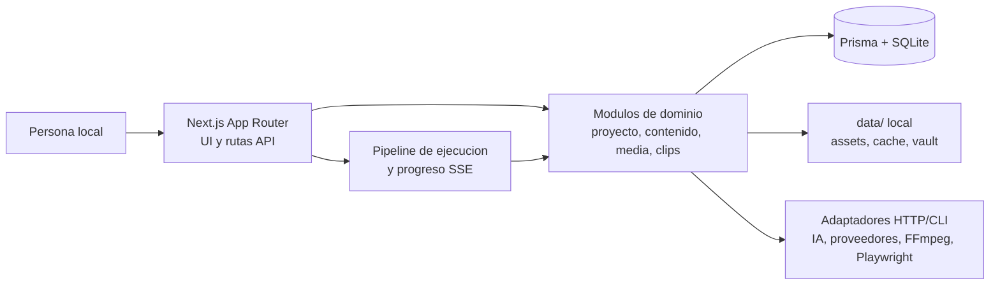
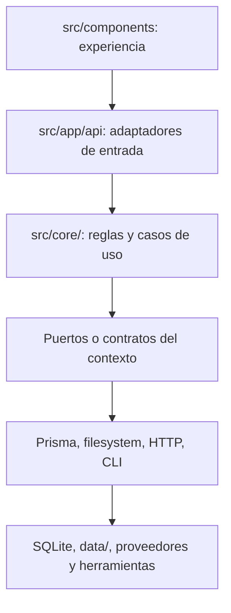

# Constitución de arquitectura

| Campo | Valor |
|---|---|
| Estado | `aprobada-vigente` |
| Origen | `/onboard` brownfield del 2026-08-21 |
| Aprobada por | `norkc` |
| Fecha de aprobación | `2026-08-21` |
| Arquitectura observada | Monolito modular local con fronteras hexagonales parciales |
| ADR base | [ADR-0001](adr/ADR-0001-arquitectura-heredada-monolito-modular-local.md) |
| Nivel ASVS objetivo | OWASP ASVS 5.0.0 nivel 2 |

Esta constitución describe el sistema existente y fija su regla de evolución. Su aprobación no
declara segura ninguna spec ni sustituye los gates humanos posteriores de cada fase.

## 1. Contexto y fuerzas observadas

RRSS Studio es una aplicación web local, dirigida a Windows 11, que permite analizar una app,
conservar resultados por proyecto y producir/revisar material de redes sociales. Un único proceso
Next.js sirve interfaz, rutas API, SSE y ejecuciones de pipelines; Prisma persiste los hechos en
SQLite y `data/` conserva assets, cachés y el vault local.

El dominio no es un CRUD fino: coordina estados de ejecuciones, generación de contenido, medios,
herramientas del sistema, proveedores remotos y credenciales locales. A la vez, no hay evidencia
de varios despliegues, equipos autónomos, métricas de escalado, CI/CD, observabilidad distribuida
ni on-call. La operación prevista es una instalación local, con una persona que revisa antes de
publicar y con capacidades externas opcionales.

### Árbol de decisión aplicado

| Pregunta | Evidencia | Consecuencia |
|---|---|---|
| Dominio | `src/core/pipeline/`, `content/`, `media/`, `clips/`, `secrets/` contienen reglas y flujos, no solo endpoints CRUD. | Mantener módulos de dominio y aislar los detalles volátiles en adaptadores. |
| Equipo y operación | No hay evidencia versionada de equipos autónomos, guardias, CI/CD u operación distribuida. | No extraer servicios ni workers independientes. |
| Escala | SQLite, bus en memoria y procesos fire-and-forget se ejecutan en el servidor local. No hay medición que requiera escalado separado. | Un despliegue local único es la opción proporcionada. |
| Consistencia | Los hechos de proyecto, pieza, media y ejecución se guardan en SQLite; el progreso SSE es efímero. | Consistencia fuerte para escrituras locales; no introducir consistencia eventual ni broker. |
| Integraciones | HTTP a proveedores y herramientas/CLI locales existen detrás de `src/core/media/` y `src/core/ai/`. | Mantener adaptadores y límites de timeout/error; no propagar detalles de proveedor a UI. |
| Restricciones | Windows 11, npm, ausencia de red en el sandbox y secretos/archivos locales. | Sin cloud obligatorio; efectos locales y procesos bajo confirmación humana. |
| Horizonte | El repositorio es brownfield con módulos heredados y evolución funcional continua. | Consolidar fronteras de forma incremental, sin reescritura arquitectónica. |
| Madurez ops | No hay plataforma que sostenga microservicios, colas u observabilidad distribuida. | Microservicios, EDA distribuido, CQRS/ES y serverless quedan fuera salvo ADR posterior. |

## 2. Posición por eje

| Eje | Decisión vigente | Razón | Señal para revisarla |
|---|---|---|---|
| Despliegue | Monolito Node.js/Next.js local: UI, API, SSE y pipelines en el mismo proceso; SQLite y `data/` locales. | Es la topología observada y no existe una necesidad demostrada de fallo, despliegue o escalado independiente. | Volumen, disponibilidad o aislamiento que exijan un proceso separado, con ownership, CI/CD y observabilidad preparados. |
| Dependencias | Monolito modular con fronteras hexagonales pragmáticas. Los adaptadores de HTTP, CLI, filesystem, Prisma y proveedores no son el dominio. | `src/core/media/`, `src/core/ai/`, `src/core/secrets/` ya concentran detalles externos; rutas y pipelines aún acoplan algunas llamadas a Prisma, por lo que la frontera es parcial. | Un módulo nuevo requiera múltiples adaptadores intercambiables o las dependencias de infraestructura impidan pruebas de reglas. |
| Dominio | Contextos dentro del mismo repositorio: proyecto/inteligencia, contenido/publicación, media/estudio, clips, pipeline de ejecución y configuración/secretos. | Tienen lenguaje, datos y ciclos de cambio distinguibles, pero comparten una instalación y modelo local. | Un contexto necesite propiedad de equipo, datos o despliegue independiente real. |
| Integración | Llamadas síncronas en proceso y HTTP/CLI directo con timeout; SSE para observar ejecuciones. | Las rutas crean runs y los pipelines se ejecutan localmente; el bus `EventEmitter` no es un transporte durable. | Requisitos de entrega diferida fiable entre procesos; entonces evaluar cola con idempotencia y outbox en ADR. |
| Datos | SQLite compartida por la instalación, con propiedad lógica por contexto; Prisma para persistencia relacional y JSON serializado para documentos de dominio; filesystem bajo `data/` para binarios/caché. | Es el modelo observado y satisface una persona local multiproyecto. | Concurrencia multiusuario, aislamiento fuerte o consultas que SQLite no soporte de forma medida. |
| Experiencia | Next.js App Router: renderizado de servidor y componentes cliente; API JSON local y SSE, sin microfrontends. | Es la composición real de `src/app/` y `src/components/`. | Cliente adicional independiente o frontera de equipo que justifique un contrato de frontend separado. |
| Organización interna | Por capacidades técnicas en el árbol existente, con vertical slice permitido para cambios nuevos que toquen UI, ruta y módulo de un contexto. | Evita reordenar el brownfield; mantiene juntos los cambios de una feature sin convertir `src/core/` en utilitario global. | Un módulo concentre suficientes slices independientes para que su estructura actual reduzca la cohesión. |

## 3. Fronteras y reglas de dependencia





- `src/app/api/` valida entradas, traduce errores HTTP y llama a casos de uso/pipelines; no gana reglas de negocio nuevas.
- `src/components/` conserva estado de presentación y consume contratos de API; no accede a Prisma, secretos, filesystem ni procesos.
- Cada módulo de `src/core/` es dueño de sus tipos, coerciones y reglas. Otros módulos consumen su API explícita, no sus detalles de almacenamiento.
- Prisma y el filesystem son infraestructura. El código nuevo no debe convertir rutas o componentes en repositorios alternativos ni leer/escribir `data/` sin pasar por el módulo dueño.
- Los proveedores, IA y binarios del sistema son adaptadores. Sus errores se normalizan antes de llegar a la experiencia, y su salida se trata como dato no confiable.
- No se introduce un broker, un servicio, una base de datos adicional, un worker persistente ni una dependencia de cloud sin ADR aceptado.

### Propiedad lógica de datos

| Contexto | Hechos observados | Almacenamiento actual |
|---|---|---|
| Proyecto e inteligencia | `Project`, `Dossier`, `NavigationMap`, `Competencia`, `Leads`, `Virales` | SQLite mediante Prisma |
| Contenido y publicación | `ContentPiece`, guion, configuración, estado y marca de publicación | SQLite; JSON serializado en campos de pieza |
| Media y estudio | `MediaAsset`, `MixComposition`, ficheros de pieza y biblioteca | SQLite para metadatos; `data/media/` para binarios |
| Ejecución | `Run`, nodos y logs | SQLite; eventos vivos en memoria |
| Configuración local | estado de conectores, ajustes y secretos | SQLite para estado; `data/vault.enc` y `.vaultkey` para vault |
| Clips | trabajos e historial de laboratorio | Módulo `src/core/clips/` y almacenamiento local propio |

## 4. Stack y estructura reales

| Superficie | Tecnología observada | Responsabilidad |
|---|---|---|
| Web | Next.js 15.x, React 19, TypeScript | App Router, UI y route handlers |
| Estilos y estado | Tailwind CSS 4, React Query, Zustand, React Flow | Presentación, consulta de servidor y visualización de pipelines |
| Persistencia | Prisma 6.x y SQLite configurada por `DATABASE_URL` | Datos relacionales de instalación local |
| Validación | Zod y funciones `coerce*` de los módulos | Validar fronteras y normalizar datos persistidos/externos |
| Ejecución local | Node >=20, procesos con argumentos separados, Playwright y herramientas opcionales | Pipelines, grabación y ensamblado multimedia |
| Progreso | `EventEmitter` en `globalThis` y SSE | Progreso vivo no durable; el estado durable es `Run` |

```text
src/app/           interfaz App Router y adaptadores HTTP/SSE
src/components/    componentes de experiencia
src/core/          módulos de dominio, pipelines y adaptadores locales/remotos
src/lib/           cliente Prisma y utilidades de infraestructura compartida
prisma/            esquema SQLite
data/              estado local no versionado: assets, caché, vault y herramientas
scripts/           gates y utilidades SDD
```

La versión exacta que gobierna dependencias es `package.json`; la referencia de Next de
`AGENTS.md` no sustituye al manifiesto. No se infiere aquí una actualización de dependencias.

## 5. Seguridad, calidad y operación

### Baseline de seguridad

El objetivo es **OWASP ASVS 5.0.0 nivel 2**. Es proporcionado porque la aplicación es local, no
incorpora roles ni exposición multitenant en la spec 001, pero manipula secretos cifrados,
archivos, configuración, URLs remotas y procesos/binaries locales. No se declara ninguna spec
segura por esta decisión: toda spec sensible debe elaborar su matriz `SEC-*`, modelo de amenazas,
tests de abuso y evidencia contra L2 durante `/sdd-plan`, `/sdd-tasks` y `/sdd-verify`.

- El vault actual usa AES-256-GCM y ficheros locales ignorados; los secretos no aparecen en API,
	logs, documentación, diagnósticos ni fixtures. La instalación de la spec 001 no crea, pide ni
	autentica secretos.
- Toda entrada HTTP, fichero, URL, respuesta de proveedor, output de CLI o dato de IA se valida y
	se trata como no confiable. Se prefieren argumentos separados y `shell: false` para procesos.
- Las rutas de assets permanecen relativas y contenidas bajo `data/`; se conserva la verificación
	de pertenencia de proyecto antes de servir, reutilizar o borrar recursos.
- `localhost` es una restricción de despliegue, no un control de autorización. Exponer el proceso a
	red, añadir usuarios o acceso remoto requiere ADR y modelo de autenticación/autorización.

### Política de efectos locales y consentimiento humano

Una comprobación puede ser de solo lectura y mostrar únicamente categorías seguras. Antes de una
operación con efecto, la interfaz o asistente debe describir el ámbito, la acción, el recurso que
puede cambiar y el resultado si se rechaza; la confirmación queda separada por clase de efecto.

| Efecto | Regla vinculante |
|---|---|
| Procesos y puertos | Nunca terminar por imagen global (`taskkill /IM node.exe`) ni por puerto automáticamente desde el asistente. Detectar primero; cualquier terminación/reinicio requiere confirmación por proceso/PID o por el puerto concreto y no puede asumir que sea de RRSS Studio. |
| Caché | No borrar `.next`, `data/cache/` ni cachés de herramientas automáticamente. La confirmación identifica la ruta, si es reconstruible y el efecto de rechazarla. |
| Datos y persistencia | Una base o datos locales existentes, incompletos o incompatibles se preservan y bloquean el arranque. Un reset, borrado, recreación de esquema o migración potencialmente destructiva exige una confirmación distinta del diagnóstico y nunca continúa por defecto. |
| Fuera del repositorio | Instalar globalmente, modificar PATH, descargar en ubicaciones del sistema, tocar AppData o iniciar procesos externos requiere confirmación explícita previa. |
| Dentro del repositorio | Las acciones necesarias para una clonación limpia se declaran antes de ejecutarse. Crear dependencias o artefactos locales no autoriza cambios en datos existentes ni borra cachés. |
| Red y capacidades opcionales | La preparación básica no llama, autentica ni configura proveedores externos. Su ausencia se comunica como capacidad opcional bloqueada con efecto funcional; no impide el resultado básico aprobado. |

`iniciar.bat` es evidencia histórica de un arranque de recuperación, no una política reutilizable
por el asistente de instalación. La spec 001 deberá diseñar un contrato de resultados y una
secuencia de confirmaciones conforme a esta tabla, sin reutilizar sus efectos indiscriminados.

### Calidad y recuperación

- Para toda tarea de implementación: RED verificable, GREEN mínimo y REFACTOR; los contratos
	puros existentes se prueban con `npm run test:contracts`.
- El único gate declarado hoy es `node scripts/check-sdd.mjs`; lint, typecheck, build, seguridad,
	accesibilidad, documentación y pruebas de interfaz aún no están configurados como gates. Una
	ausencia se registra como no ejecutada, nunca como verde.
- Las ejecuciones persisten nodos y logs en `Run`; SSE y el bus en memoria son solo observabilidad
	viva. Tras reinicio, la UI se recupera desde persistencia y no presupone que el stream sobreviva.
- No se fijan SLO ni objetivos de disponibilidad distribuidos para un proceso local. Los errores
	deben ser accionables y no revelar secretos, rutas personales ni datos locales.

## 6. Decisiones vinculadas y cambio

- [ADR-0001](adr/ADR-0001-arquitectura-heredada-monolito-modular-local.md) registra esta posición
	arquitectónica y sus alternativas descartadas.
- La aprobación humana de esta constitución convierte sus reglas en vinculantes. Un cambio de eje,
	frontera, almacenamiento, exposición de red, proceso persistente o política de datos requiere
	ADR nuevo o reemplazo explícito de ADR-0001 antes de planificarlo.
- Las mejoras incrementales dentro de una frontera existente se planifican en la spec afectada; no
	usan este documento para introducir requisitos no aprobados.
