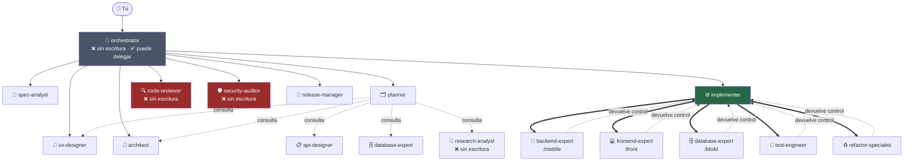
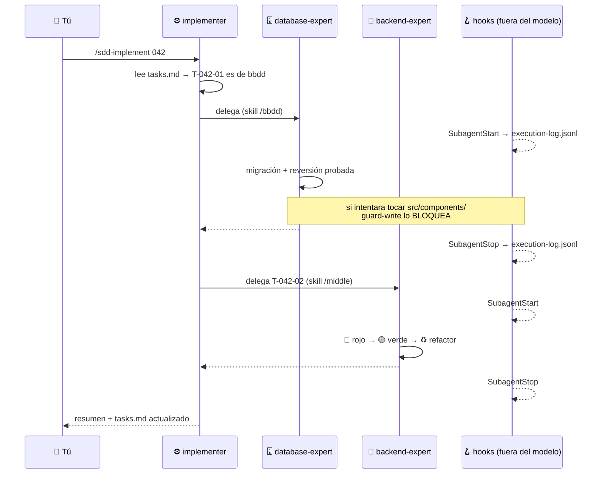

# Cómo trabajar con los agentes

Guía práctica del ecosistema SDD: cómo se comunican los agentes, por dónde empezar, cómo
funciona el TDD y cómo se validan calidad y seguridad.

Referencias: [`AGENTS.md`](../../AGENTS.md) (la constitución) ·
[`docs/agents/CATALOG.md`](../agents/CATALOG.md) (los 20 agentes) ·
[`docs/integrations/IDE-COMPATIBILITY.md`](../integrations/IDE-COMPATIBILITY.md) (qué funciona en cada IDE)

---

## 1. Cómo se comunican los agentes

### 1.1 Quién puede llamar a quién



Tres reglas que **no son norma escrita, son herramienta**:

| Regla | Cómo se impone |
|---|---|
| Solo `orchestrator`, `planner` e `implementer` delegan | Los otros 17 no tienen la herramienta `Agent`. No pueden llamar a nadie aunque se lo pidas |
| Los especialistas **nunca encadenan** | Hacen su trabajo y devuelven el control. No deciden la fase siguiente |
| Profundidad máxima: **2 niveles** | Se cuentan **saltos entre agentes**; tú no eres un nivel. Ver abajo |

### 1.2 Cómo se cuenta la profundidad

La cadena más larga permitida es exactamente esta:

```
Tú  →  orchestrator  →  implementer  →  backend-expert
       └─ nivel 0 ────┴─ nivel 1 ────┴─ nivel 2        ✅ máximo
                                          └───────────→  ❌ nivel 3, prohibido
```

**Tú no cuentas como nivel**: no eres un agente delegado, eres quien arranca. Lo que se limita son
los saltos de delegación **entre agentes**.

Por eso los especialistas **devuelven el control** en vez de encadenar: si el `backend-expert`
llamara a otro, se saldría del límite. Y por eso solo `orchestrator`, `planner` e `implementer`
tienen la herramienta de delegación — los otros 17 no pueden pasar de ahí ni queriendo.

> Si entras directo por `/sdd-implement` sin pasar por el `orchestrator`, la cadena es más corta
> —`implementer` → especialista— y te queda un nivel de margen. No es peor: el `orchestrator`
> solo aporta cuando no sabes en qué fase estás.

### 1.3 Un intercambio real



Lo importante: **los hooks escriben en paralelo, sin que el modelo participe**. Por eso
`execution-log.jsonl` es evidencia y el chat solo es narración.

### 1.4 El protocolo de handoff

Todo agente cierra con este bloque. Es el contrato entre fases:

```
### HANDOFF
- Agente origen: <nombre>
- Fase completada: <fase SDD>
- Artefactos: <rutas de ficheros>
- Decisiones tomadas: <lista, o "ninguna">
- Bloqueos / supuestos: <lista, o "ninguno">
- Siguiente agente sugerido: <nombre> — motivo: <por qué>
- Contexto que necesita: <mínimo imprescindible>
```

### 1.5 Handoff ≠ aislamiento

Son dos problemas distintos y confundirlos es la causa de que un ecosistema "bien diseñado"
acabe con el orquestador programando:

| | Qué consigue | Con qué |
|---|---|---|
| **Handoff** | Que el trabajo **avance** | El bloque `### HANDOFF`, los botones, la delegación |
| **Aislamiento** | Que un agente **no pueda** hacer lo que no le toca | `tools` + `.sdd/territories.json` + `guard-write.mjs` |

Un handoff impecable no impide nada: deja igual de libre al agente que lo recibe para escribir
donde no debe. El aislamiento es cuestión de **herramientas y rutas**, no de flujo.

**Tres capas:**

1. **Herramientas.** Quién delega, en quién, y quién no puede escribir.
2. **Territorio.** [`.sdd/territories.json`](../../.sdd/territories.json) declara qué rutas son de
   quién. La regla es *no entres en el territorio de otro*, no *quédate en el tuyo*: lo que no es
   de nadie se permite, porque una guarda que bloquea lo desconocido se desactiva el primer día.
3. **CI.** `check-sdd.mjs` valida el mapa; `test-hooks.mjs` prueba las guardas.

Las tres en Claude Code y Cursor (probadas) · las tres también en VS Code según su documentación
de hooks, que es *preview* y no se ha ejecutado en vivo · en Codex los cuatro auditores usan
sandbox de solo lectura y el CI valida la paridad, pero no hay territorio por ruta · en
Antigravity solo queda el CI.

**Y una pregunta que surge sola al ver el árbol**: no hay `skills/` ni `hooks/` bajo `.github/` ni
`.cursor/` **a propósito**. Las skills son estándar abierto y las cuatro superficies leen
`.agents/skills/` de forma nativa; los hooks son scripts de Node que ejecuta quien los invoque, y
VS Code lee `.claude/settings.json`. Crear `.github/hooks/` haría que VS Code cargara la
configuración **dos veces** y cada guarda se ejecutaría por duplicado. Se duplica solo donde el
formato del host obliga —los agentes—, y siempre como envoltorio fino que referencia al canónico.

---

## 2. Por dónde empezar

**Si dudas: `/sdd-start`.** Clasifica la petición y te lleva a la fase correcta.

| Situación | Comando | Agente |
|---|---|---|
| **PRD global o proyecto nuevo** | `/sdd-intake` | `orchestrator` → `spec-analyst` / `ux-designer` |
| **Proyecto nuevo con producto aprobado** | `/sdd-init` | `architect` |
| **Modificación / funcionalidad nueva** | `/sdd-specify` | `spec-analyst` |
| Repo existente sin documentar | `/onboard` | `research-analyst` → `architect` |
| No sé en qué punto estoy | `/sdd-status` | — |
| Algo se ha caído en producción | `/respond-incident` | — |
| Revalidar formatos y estándares | `/sdd-refresh` | `research-analyst` |

### Qué automatiza el CLI y qué sigue razonando el agente

```bash
node scripts/sdd-project.mjs status --json [--spec NNN]
node scripts/sdd-project.mjs scaffold --spec NNN --phase design|plan|tasks|verify [--dry-run]
node scripts/sdd-project.mjs trace-status --spec NNN --json
node scripts/check-sdd.mjs --json [--strict] [--spec NNN]
```

Esto evita releer el árbol, copiar plantillas y contar IDs a mano. El agente sigue decidiendo
requisitos, arquitectura, controles, descomposición de tareas y veredictos. Las skills grandes
cargan `references/` solo cuando el área afecta a la tarea.

Generación de DTO/tipos/clientes no es universal. Cada proyecto puede aprobar una entrada en
`.sdd/generators.json` y ejecutar `node scripts/sdd-project.mjs generate <id> --dry-run` antes de
la ejecución real. El runner usa programa+argv con `shell:false`, no instala dependencias,
confina las rutas declaradas de inputs/outputs y detecta edición manual de código generado. El
programa aprobado sigue siendo código de confianza que se ejecuta con los permisos del usuario:
no queda aislado por el sistema operativo. `/onboard` solo propone generadores que ya existen; la
persona los aprueba.

### PRD o proyecto nuevo → `/sdd-intake`

Indica al `orchestrator` dónde está el PRD y, si existe, el diseño de Stitch/Figma o un boceto.
El intake crea `PRD.md`, `USE-CASES.md`, `FEATURE-MAP.md` y `SOURCES.md`; reconcilia diferencias y
pausa para aprobación humana. No elige arquitectura ni genera código. En un host sin subagentes,
te indica el perfil exacto y reanuda desde esos documentos, no desde la memoria del chat.

### Producto aprobado → `/sdd-init`

El `architect` fija los principios, **elige la arquitectura** por ejes y crea
`docs/architecture/constitution.md` + el ADR-0001. A partir de ahí esa constitución es
**vinculante para todos los agentes**.

Los ejes que se deciden (no se elige una etiqueta, se elige una posición por eje):

| Nivel | Eje | Opciones |
|---|---|---|
| Macro | Despliegue | monolito · web+worker · servicios · serverless · edge |
| Macro | Dependencias | layered · hexagonal · clean/onion |
| Macro | Dominio | módulos · bounded contexts · servicios |
| Macro | Integración | llamada · cola · evento · stream · batch |
| Macro | Datos | compartidos/propios · ACID/eventual · OLTP/OLAP |
| Macro | Experiencia | SSR · SPA · móvil · desktop · microfrontend |
| **Micro** | Organización interna | por capas técnicas · **vertical slice** — se decide **por módulo** |

**Ley del proyecto**: empieza en *monolito modular con fronteras hexagonales*. Extraer servicios
es fácil si las fronteras existen; crearlas después no lo es.

### Modificación → `/sdd-specify`

**El `architect` NO interviene.** La arquitectura ya está decidida y se lee de
`constitution.md`. Solo vuelve si el cambio **la viola**, y entonces produce un ADR nuevo.

> Es la diferencia más importante entre los dos circuitos: si cada funcionalidad vuelve a elegir
> arquitectura, no tienes arquitectura, tienes opiniones sucesivas.

### El circuito completo

```text
[/sdd-intake] → /sdd-init u /onboard → /sdd-specify → /sdd-clarify → /sdd-design → /sdd-plan → /sdd-tasks → /sdd-implement → /sdd-verify → /sdd-ship
```

| Fase | Produce | Puerta de salida |
|---|---|---|
| `/sdd-specify` | `spec.md` | Requisitos EARS con **MoSCoW sobre esfuerzo** (must ≤ 60 %), cero tecnología |
| `/sdd-clarify` | `clarifications.md` | 0 marcadores `[NEEDS CLARIFICATION]` |
| `/sdd-design` | `design.md` | **Dirección visual aprobada**, flujo con caminos de error, **seis estados por pantalla**, **elemento con carácter**, a11y. *Se salta si no hay UI* |
| `/sdd-plan` | `plan.md`, `data-model.md`, `contracts/` | Conforme a la constitución |
| `/sdd-tasks` | `tasks.md` | Tareas atómicas **separadas por middle / front / bbdd**, con test |
| `/sdd-implement` | Código + tests | TDD estricto. Cada tarea entra por `/middle`, `/front` o `/bbdd` |
| `/sdd-verify` | Informes | Todos los gates en verde |
| `/sdd-ship` | PR, CHANGELOG | GO/NO-GO firmado por una persona |

> **Aviso práctico**: son 9 fases. Para un cambio trivial cuesta más el proceso que el cambio.
> No hay vía rápida declarada todavía: es una carencia conocida.

---

### La dirección visual es una puerta, no una recomendación

Antes de la primera pantalla del proyecto hay que cerrar
[`docs/design/DIRECCION-VISUAL.md`](../design/DIRECCION-VISUAL.md) **y que la apruebes tú**.

Existe porque los seis estados y la accesibilidad son un **suelo, no un techo**: una interfaz
puede cumplirlos enteros y ser el MVP de cuatro cajas grises. Y hay un sesgo activo en contra —la
interfaz generada por un modelo converge en un aspecto genérico reconocible: tarjeta redondeada,
gris neutro, espaciado uniforme, titular apenas mayor que el cuerpo— porque es el camino de menor
resistencia.

Lo que se decide ahí, una vez y para todo el proyecto:

| Decisión | Trampa que evita |
|---|---|
| **Referencias reales + una antirreferencia** | "Moderno y limpio" no descarta nada |
| **Tres adjetivos que excluyan algo** | "Bonito, profesional, moderno" no decide nada |
| **Escala tipográfica con contraste real** | Titular de 32 sobre cuerpo de 16 no es jerarquía |
| **Densidad declarada** | Si no, se hereda del framework |
| **Movimiento y `prefers-reduced-motion`** | Animación sin criterio se nota más que su ausencia |
| **Qué NO va a hacer el proyecto** | Cierra discusiones antes de que ocurran |

Y **un elemento con carácter por pantalla**, obligatorio. No tiene que ser decorativo: un dato
bien presentado tiene más carácter que una ilustración. "La tarjeta estándar" es ausencia de
decisión.

`check-sdd` falla en `--strict` si hay `design.md` y la dirección sigue sin aprobar. `/front`
comprueba el código contra ella: es donde un diseño con carácter se diluye sin querer.

## 3. Cómo funciona el TDD

Ciclo obligatorio en `/sdd-implement`. También suelto con `/tdd` para un bug o una regla aislada.

### 🔴 RED

- Escribe **un solo test**, el de esa tarea. Nombre: `debe_<comportamiento>_cuando_<condición>`.
- Ejecútalo y **pega la salida real del fallo**.
- Comprueba que falla **por el assert**, no por un import roto.
  *Un rojo por el motivo equivocado no demuestra nada.*

### 🟢 GREEN

- El código **mínimo**. Está permitido devolver una constante si eso pone el test en verde: el
  siguiente test te obligará a generalizar. Eso es la disciplina, no una trampa.
- Test en verde **y suite completa en verde**. Pega las dos salidas.

### ♻️ REFACTOR

Solo con verde:

- Nombres que revelan intención.
- Elimina duplicación **de conocimiento**, no de líneas.
- Guard clauses en lugar de anidamiento; un nivel de abstracción por función.
- Aplica SOLID. Si aparece un patrón, justifícalo.
- **Refactoriza también el test**: es código de primera clase.

No añadas comportamiento aquí. No refactorices en rojo.

### Vuelta al 🔴

Casos que casi siempre faltan: vacío · nulo · límite exacto · negativo · duplicado ·
concurrencia · permiso denegado · dependencia externa caída.

### Lo que sostiene el ciclo

- **Cada tarea nace de un criterio de aceptación, que nace de un test.** Si no puedes nombrar el
  test, la tarea está mal cortada.
- **Pirámide**: muchos unitarios sin I/O · algunos de integración con BD real o testcontainers ·
  pocos E2E de flujos críticos.
- **Contract tests** en toda frontera entre sistemas.
- **Prohibido mockear lo que no controlas**: envuélvelo en un puerto y mockea el puerto.
- **Cobertura orientada al riesgo, no un porcentaje universal.** 80 % con asserts triviales vale
  menos que 60 % sobre los caminos que cobran dinero. La regla real es *ninguna zona crítica sin
  probar*.
- **Mutation testing en el core** (Stryker en TS, mutmut en Python). Es el único indicador que
  detecta tests que mienten, y los tests generados por un modelo tienen justo ese patrón:
  cobertura presentable, *mutation score* bajo.
- Un *spike* exploratorio puede saltarse el ciclo, pero **se etiqueta como desechable y no se
  integra**.

> **El reparto de propiedad**: tú posees la especificación y el test; el agente posee la
> implementación. Así no se valida a sí mismo.

---

## 4. Calidad y seguridad

Ambas viven en `/sdd-verify`, en 8 pasos. **Si el paso 1 sale rojo, se para ahí**: no se revisa
código que no compila ni pasa tests.

| Paso | Quién | Qué |
|---|---|---|
| 1 · Automático | *ningún modelo* | `check-sdd --strict` + suite + cobertura + lint + typecheck + build + auditoría de dependencias |
| 2 · Trazabilidad | — | Tabla RF → CA → test. Sin huecos |
| 3 · Revisión | `code-reviewer` | Diff de la rama. Veredicto ✅/⚠️/❌ con `ruta:línea` |
| 4 · Diseño | `refactor-specialist` | SOLID, DRY, KISS, YAGNI. Violación → se arregla o se justifica por escrito |
| 5 · **Seguridad** | `security-auditor` | OWASP Top 10 + ASVS + Agentic si hay LLM |
| 6 · Calidad de la suite | `test-engineer` | ¿Tests sin assert? ¿Fallan si rompes el código? ¿Mutation score? |
| 7 · Evidencia | — | `evidence.md` + `execution-log.jsonl` |
| 8 · Operación | — | Logs, métricas, migración reversible, plan de reversión |

### Seguridad

**Nivel ASVS L2 por defecto** en aplicación expuesta a internet (L1 solo herramienta interna sin
datos personales; L3 crítico o regulado). Se declara en la constitución y el auditor audita
**contra ese nivel**.

**`CRÍTICO` o `ALTO` bloquea la entrega.** No se aplaza con un ticket.

Y no es una fase final: la seguridad está activa todo el rato — hooks que bloquean `.env` y
comandos destructivos, validación en la frontera, autorización en cada caso de uso del lado
servidor, consultas parametrizadas, RLS probado con dos tenants, secretos fuera del repo.

### Definition of Done

Una tarea no está hecha hasta que:

- [ ] Test rojo previo demostrado y ahora verde
- [ ] Toda la suite pasa; sin `.only` ni tests saltados
- [ ] Lint + formato + tipado estricto sin warnings
- [ ] Sin secretos, claves ni PII en código, logs o tests
- [ ] *Mutation score* del core como **número** en `evidence.md`, no como adjetivo
- [ ] `security-auditor` sin hallazgos críticos ni altos
- [ ] `refactor-specialist` sin violaciones SOLID sin justificar
- [ ] Trazabilidad: código ↔ tarea ↔ criterio de aceptación ↔ spec
- [ ] `evidence.md` con las ejecuciones reales **y los controles que NO se ejecutaron**
- [ ] Observabilidad en los caminos nuevos

### Lo que hace que esto no sea teatro

1. **`code-reviewer` y `security-auditor` no tienen escritura.** No pueden arreglar lo que
   auditan. Quien juzga no repara: arreglar lo que auditas es auditarte a ti mismo.
2. **`check-sdd --strict` no es un agente.** Comprueba contra el sistema de ficheros que toda
   tarea `hecho` tiene evidencia y ejecución registrada, que ningún CA quedó sin test, que no se
   planificó sobre ambigüedades y que el log no se ha manipulado. Si sale con código 1, **se
   para, diga lo que diga el chat**.

Cuando algo sale rojo, el camino de vuelta es **siempre hacia atrás**: `verify` → `implementer` →
arreglar → `verify` otra vez. Nunca se parchea hacia adelante.

---

## 5. Chuleta

```bash
node scripts/check-sdd.mjs            # estructura y coherencia
node scripts/check-sdd.mjs --strict   # + evidencia y trazabilidad (antes de entregar)
node scripts/skills-sync.mjs --check  # skills de terceros fijadas y con licencia
node scripts/test-hooks.mjs           # las guardas deciden lo que documentan
SDD_GATES=off                         # desactiva los gates temporalmente
```

| Quiero… | Comando |
|---|---|
| Empezar desde un PRD o un proyecto nuevo | `/sdd-intake` |
| Elegir arquitectura con producto aprobado | `/sdd-init` |
| Añadir una funcionalidad | `/sdd-specify` |
| Diseñar las pantallas | `/sdd-design` |
| Implementar backend | `/middle` |
| Implementar interfaz | `/front` |
| Implementar datos | `/bbdd` |
| Un ciclo TDD suelto | `/tdd` |
| Auditar seguridad | `/security-scan` |
| Saber por qué hicimos X | `/bitacora` |
| Entregar | `/sdd-verify` → `/sdd-ship` |

### Lo que NO se hace

- Escribir código sin spec ni test rojo previo.
- Elegir microservicios "porque escala" sin ADR ni plataforma que lo sostenga.
- Meter lógica de negocio en controladores, componentes de UI o triggers de BD.
- Refactorizar fuera del alcance sin acordarlo.
- `git push --force`, borrar ramas o tocar producción sin permiso explícito.
- **Marcar algo como terminado sin ejecutar los tests y mostrar la salida real.**
