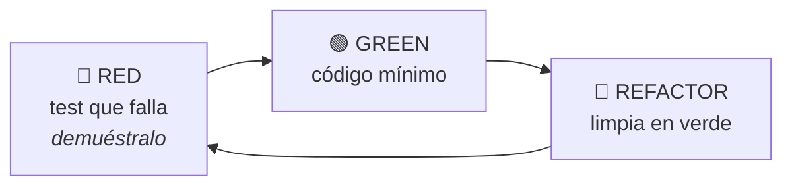

# Estrategia de test

Documento vinculante. Lo aplica `test-engineer` y lo exige `code-reviewer`.

---

## 0. Cuánto verificar

Antes de decidir *cómo* se prueba algo, decide *cuánto*. El sistema no aplica el mismo rigor a un
cálculo de dinero que a un experimento con adopción desconocida, y fingir que sí lleva a lo mismo
por dos caminos: o se subprueba lo crítico, o se gastan cuarenta horas blindando una función que
nadie va a usar.

### Las cuatro preguntas

| Pregunta | Verificar | Observar |
|---|---|---|
| ¿Conoces el comportamiento esperado? | Sí: contrato definido, regla escrita | No: quieres descubrir cómo se usa |
| ¿Cuál es el coste de fallar? | Alto: dinero, datos, seguridad | Bajo o medio: fricción, estética |
| ¿Es estable el requisito? | Sí: regla consolidada | No: en exploración, cambia cada semana |
| ¿Puedes simular el escenario real? | Sí: entrada → salida | No: depende de gente real, datos reales, red real |

Tres o más *verificar* → suite exhaustiva. Tres o más *observar* → camino feliz cubierto más
instrumentación que te diga qué pasa de verdad. Los tests predicen los fallos que ya sabes nombrar;
la observabilidad descubre los que no.

### Por etapa del proyecto

| Etapa | Peso | Por qué |
|---|---|---|
| Producto sin validar | Observar > verificar | Todavía no sabes qué sobrevive |
| Crecimiento | Equilibrio | Optimizas sin romper lo que ya funciona |
| Escala | Verificar > observar | La estabilidad es la funcionalidad |

### La restricción que no se negocia

> Esto calibra la **profundidad** de la verificación: cuántos casos límite, si hay E2E, si se mide
> mutation score. **Nunca** autoriza saltarse el ciclo rojo-verde de una tarea de la spec.
>
> "Es un experimento" no es una excepción al RED. Es un motivo para escribir tres tests en vez de
> treinta.

La decisión se escribe en `plan.md` cuando no es obvia. Una calibración que no se registra es una
opinión que nadie podrá discutir en la revisión.

---

## 1. TDD: el ciclo



1. **RED** — escribe el test, ejecútalo, **pega la salida del fallo**. Verifica que falla por
   el assert y no por un import roto.
2. **GREEN** — el código mínimo. Está permitido devolver una constante: el siguiente test te
   obligará a generalizar.
3. **REFACTOR** — con verde, limpia. Los tests también se refactorizan.

**Un test que nunca ha fallado no demuestra nada.**

---

## 2. Pirámide

| Nivel | Proporción | Qué prueba | Velocidad | Herramienta |
|---|---|---|---|---|
| Unitario | ~70 % | Dominio y aplicación, sin I/O | ms | `<...>` |
| Integración | ~20 % | Adaptadores reales (testcontainers) | s | `<...>` |
| Contrato | transversal | Cada frontera entre sistemas | s | `<...>` |
| E2E | ~10 % | Solo flujos críticos de negocio | min | Playwright |

**Antipatrón: cono de helado** (muchos E2E, pocos unitarios). Si la suite tarda más de
10 minutos en CI, algo está en el nivel equivocado.

---

## 3. Cómo se escribe un test

- Nombre: `debe_<comportamiento>_cuando_<condición>`. Se lee como una frase.
- Arrange · Act · Assert separados visualmente. **Un solo Act.**
- Un motivo de fallo por test.
- Sin lógica: nada de `if` ni bucles. Casos múltiples → `test.each` / `@parametrize`.
- Determinista: reloj, aleatoriedad, UUIDs y red **inyectados**. Nunca `sleep`; espera por condición.
- Independiente del orden; crea y limpia su propio estado.
- Prueba **comportamiento observable**, no implementación.
- Datos con Test Data Builder u Object Mother.

---

## 4. Dobles

| Doble | Para qué |
|---|---|
| Dummy | Rellenar un parámetro que no se usa |
| Stub | Devolver datos fijos |
| Spy | Verificar que se llamó |
| Mock | Verificar interacción con expectativas |
| **Fake** | Implementación ligera real (repositorio en memoria) ← **el preferido** |

**No mockees lo que no controlas.** Envuelve la librería de terceros en un puerto propio y
haz un fake de ese puerto. Mockear el SDK de un proveedor es deuda garantizada: cuando
cambien su API, tus tests seguirán en verde mintiendo.

---

## 5. Casos límite obligatorios

Vacío · nulo · uno · muchos · límite exacto (n, n-1, n+1) · negativo · cero · desbordamiento ·
Unicode y emojis · zonas horarias y cambio de hora · concurrencia y carrera · idempotencia ·
fallo de red y timeout · reintento · permisos insuficientes · dependencia externa caída ·
datos corruptos o parciales.

---

## 6. Tests de contrato

En cada frontera (API pública, evento publicado, integración con terceros), el contrato de
`contracts/` genera el test. **Consumer-driven**: el consumidor declara lo que espera, el
productor lo verifica en su CI. Un cambio incompatible **debe romper el build**.

---

## 7. E2E

- Solo flujos críticos de negocio: registro, login, compra, publicación.
- Selectores por **rol y texto accesible** (`getByRole`), nunca por clase CSS.
- Sin `waitForTimeout`: espera por estado.
- Datos propios por test, creados **por API**, no por UI.
- Un E2E intermitente se arregla o se borra. Un test flaky enseña al equipo a ignorar el rojo,
  y eso es peor que no tener test.

### Selectores encapsulados por pantalla

Los selectores y las acciones de una pantalla viven en **un solo sitio**, no repartidos por los
tests. Cuando cambia la interfaz se toca ese sitio y los tests no se enteran.

```
class PaginaCarrito:
    boton_pagar   → localizador por rol accesible
    fijar_cantidad(n)
    pagar()
```

El test queda escrito en lenguaje de negocio —`carrito.fijar_cantidad(2)`, `carrito.pagar()`— y no
en lenguaje de DOM. Sin esto, el tercer cambio de maquetación rompe quince tests que no probaban
la maquetación.

### Regresión visual

Para lo que un assert no ve: color, tamaño, posición, saltos de layout, rotura responsive.

- Primera ejecución fija la **línea base**; las siguientes comparan contra ella.
- Tolerancia declarada y justificada. Sin tolerancia, el antialiasing de otra máquina rompe el build.
- La línea base se versiona y se revisa como código: aceptar un cambio visual es una decisión, no
  un `--update-snapshots` a ciegas.
- No sustituye a los tests funcionales. Detecta que algo cambió, no que algo esté bien.

### La suite también se observa

Un fallo que solo dice "3 tests rojos" cuesta horas. Un fallo con traza, captura y vídeo cuesta
minutos. Configura el runner para conservarlos **solo en fallo** —en verde son basura que llena el
disco— y súbelos como artefacto en CI, también cuando el job falla.

**No construyas un panel propio para esto.** El informe navegable, el visor de trazas y la salida en
JSON ya vienen con la herramienta, los mantiene otro y están mejor que lo que vas a escribir tú. Si
necesitas una cifra agregada, sácala del JSON que el runner ya emite.

---

## 8. Criterios de suficiencia

### Cobertura por riesgo de negocio

**No hay umbral de cobertura global.** Un porcentaje único sobre todo el repositorio es la métrica
que permite estar en verde al 94 % con los cálculos de dinero al 60 %: sube donde es barato subir
—tipos, constantes, envoltorios— y no dice nada de lo que puede hundir el producto.

La pregunta no es *cuánto está cubierto*, es **qué pasa si esto falla**:

| Tier | Umbral | Criterio de clasificación |
|---|---:|---|
| **CORE** | 100 % | Maneja dinero, procesa datos críticos, decide permisos, o concentra reglas de negocio complejas. Si falla, se pierde dinero, datos o confianza |
| **IMPORTANT** | 80 % | Lo ve o lo toca el usuario: interfaz, interacción, validación, navegación. Si falla, el usuario se frustra |
| **INFRASTRUCTURE** | excluido | Sin lógica propia y validado por el compilador o el esquema: tipos, constantes, configuración estática. Testearlo es inflar la cifra |

**Regla de defecto estricto:**

> Todo módulo **sin tier declarado se verifica al 100 %**. Bajarlo a IMPORTANT o INFRASTRUCTURE es
> una decisión que se escribe y se justifica en `plan.md`.

Esto es deliberadamente incómodo. Con un suelo global, olvidarse de clasificar deja código
desprotegido en silencio; con defecto estricto, deja un umbral molesto que obliga a clasificar.
Clasificar cuesta menos que justificar por qué un módulo sin clasificar está al 40 %.

El tier se declara en `plan.md` y se impone **por ruta** en la configuración del runner. Si el
runner del proyecto solo admite umbral global, no se finge cumplimiento: se declara en
`evidence.md` como control parcialmente ejecutado, con su riesgo y su dueño.

### El resto de criterios

| Métrica | Umbral |
|---|---|
| Mutation score en el core | ≥ `<...>` % |
| Duración de la suite en CI | < 10 min |
| Tests flaky | 0 |
| `.only` / `.skip` en la rama principal | 0 |

La cobertura, incluso por tier, es un **termómetro**. Un 100 % con asserts triviales vale menos que
un 70 % con casos límite reales. Por eso existe el mutation testing.

### Dos formas de mentir con la cobertura

**Inflarla.** Tests que recorren código sin comprobar nada: construir un objeto y verificar que la
propiedad que acabas de asignar vale lo que le asignaste. Sube la cifra, no atrapa ningún fallo, y
hay que mantenerlo. Si el compilador ya lo valida, no lo pruebes: es INFRASTRUCTURE.

**Mockearlo todo.** Sustituir por un doble la función que de verdad quieres probar. El test pasa
siempre porque comprueba el doble, no el código. Cuando la implementación real se rompe, la suite
sigue verde mintiendo. La regla de §4 —*no mockees lo que no controlas*— tiene su reverso: **no
mockees lo que sí controlas y es lo que estás probando.**

**Y por eso importa más que antes.** Los tests generados por un modelo tienen un patrón
reconocible: cobertura presentable y *mutation score* bajo, porque no detectan los defectos que se
les inyectan. Herramientas: **Stryker** (TypeScript/JS), **mutmut** (Python). Ratio test:código
sano en proyectos con TDD real: **1:1 a 1,5:1**.

El umbral de *mutation score* **no tiene cifra universal defendible**: se declara en la
constitución del proyecto y se justifica. Lo que no es negociable es medirlo en el core y
reportarlo en `evidence.md` como número, no como adjetivo.

El rigor se justifica con evidencia del propio proyecto: defectos escapados, caminos críticos,
mutation score y tiempo de feedback. Las cifras externas pueden orientar una investigación, pero
no se copian como umbral ni como decisión automática.

---

## 9. Auditoría de la suite

Señales de que los tests mienten: tests sin assert · asserts triviales (`expect(true)`) ·
tests que nunca han fallado · mocks que replican la implementación · dependencia del orden ·
setup gigante duplicado · cobertura alta con aserciones pobres.

Comprobación rápida: rompe una línea de producción a propósito. Si la suite sigue en verde,
esa línea no está probada.

## 10. Gates de este repositorio

RRSS Studio aplica estos gates reales declarados en
[`.sdd/checks.json`](../../.sdd/checks.json):

| Gate | Velocidad | Comando | Qué verifica |
|---|---|---|---|
| `sdd` | fast | `node scripts/check-sdd.mjs` | estructura, trazabilidad y evidencia del circuito |
| `lint` | fast | `npm run lint` | sintaxis de los módulos y reglas de `.editorconfig` |
| `typecheck` | fast | `npm run typecheck` | contratos TypeScript sin emitir artefactos |
| `test` | fast | `npm test` | componentes, contratos e instalador local |
| `build` | fast | `npm run build` | compilación limpia de Next.js, incluidas todas las rutas API |
| `security` | slow | `node scripts/scan-secrets.mjs --json` | secretos en el árbol versionado |
| `deps-audit` | slow | `npm audit --audit-level=high` | vulnerabilidades altas o críticas en producción y tooling ejecutado por CI/build |

CI ejecuta además `npm ci` en Ubuntu y un smoke limpio en Windows 11, dentro de una ruta con
espacios: crea SQLite sin seeds, exige cero filas de negocio, compila, arranca, consulta
`/api/health/ready` y carga `/ajustes`.

### Overrides de seguridad acotados

Mientras Next 15 y Prisma 6 no publiquen una revisión compatible que eleve sus dependencias
transitivas, el lock fuerza `postcss@8.5.26`, `sharp@0.35.3` y `deepmerge-ts@8.0.0` para corregir
avisos HIGH. No se adopta Next 16 ni Prisma 7 dentro de este parche porque supondría una migración
mayor fuera de alcance. `npm run smoke:dependency-overrides`, `prisma db push`, el build y el smoke
HTTP de Windows verifican respectivamente CSS, procesamiento de imagen, configuración Prisma y
arranque de Next antes de aceptar esas sustituciones.

### Gates no configurados y por qué

Un gate vacío sin explicación es indistinguible de un descuido. Pero decir solo "no configurado"
mete en el mismo saco tres cosas que no se parecen: lo que **no aplica** a este artefacto, lo que
aplica y **todavía no está**, y lo que **sí se ejecuta pero en otro sitio**. Sin distinguirlas, la
lista no dice si falta trabajo o si la decisión ya está tomada. Por eso cada ausencia declara su
clase además de su motivo:

| Gate | Clase | Motivo por el que no se ejecuta aquí |
|---|---|---|
| `docs` | `se-ejecuta-en-otro-sitio` | necesita el SHA base del pull request, así que corre en CI: `quality-gates.yml` y `sdd-gates.yml` lo invocan con `check-sdd --docs-diff` |
| `smells` | `pendiente` | no hay umbrales de complejidad calibrados para el código histórico; activarlo ahora daría falsos bloqueos |
| `coverage` | `pendiente` | la suite actual no produce todavía una cobertura combinada fiable de Vitest y `node:test` |
| `e2e` | `pendiente` | el smoke de instalación existe, pero los flujos con red, proveedores y vídeos requieren credenciales y consentimiento humano |
| `visual` | `pendiente` | no existe un almacén aprobado de capturas de referencia para comparación visual |
| `a11y` | `pendiente` | no existe aún un runner de navegador estable para auditar todas las pantallas dinámicas |
| `mutation` | `pendiente` | no hay motor de mutación configurado ni presupuesto de ejecución acordado |

Estos motivos se verifican, no solo se escriben:
`scripts/test-install.mjs::gates_no_configurados_tienen_motivo` falla si un identificador
aparece en `unconfigured` sin fila aquí, si el motivo es vago o si el gate está a la vez
configurado y declarado ausente;
`scripts/test-install.mjs::cada_ausencia_declara_su_clase` exige que la clase sea una de las tres
y que `se-ejecuta-en-otro-sitio` diga dónde.

### Evidencia reutilizable en el cierre editorial

`run --release` no reduce la suite funcional inicial: consume un `run --slow` verde y solo
reutiliza coverage, E2E y a11y si coinciden ancestro, runtime, checks y huella material. Ejecuta
otra vez trace-audit, secretos, strict y docs-diff. `scripts/test-release-gates.mjs` prueba PASS,
evidencia ausente/roja/manipulada, cambios de código o configuración y tag sin cambio de bytes.
La salida usa `execution: executed|reused` y conserva `sourceRunId`; un fallo muestra el slow
completo sin lanzarlo automáticamente.

### Un motivo que caduca es peor que no haberlo escrito

`a11y` estuvo declarado inaplicable durante nueve specs con el motivo «no hay superficie visual».
Era cierto cuando se escribió. Entretanto el repositorio empezó a publicar tres páginas HTML y
nadie volvió a leer la fila. Lo mismo le pasaba a `visual`, y `coverage` seguía justificándose
por una dependencia que ya no hacía falta: V8 recolecta cobertura por su cuenta desde mucho antes
de la versión de Node que este artefacto exige.

El problema no es equivocarse: es que una decisión caducada **aparenta ser una decisión tomada**,
y por eso nadie la revisa. `scripts/test-install.mjs::un_motivo_caducado_falla` convierte esa
caducidad en un fallo: si un motivo niega la existencia de una superficie que el árbol versionado
sí contiene, el gate se pone rojo y nombra los ficheros que lo desmienten.
