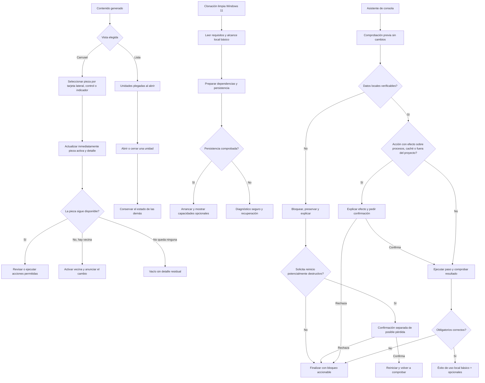

# 001 · Diseño — Bandeja de contenido e instalación local

| Campo | Valor |
|---|---|
| **Spec** | [`spec.md`](./spec.md) |
| **Estado** | aprobado |
| **Autor** | ux-designer |
| **Fecha** | 2026-08-21 |
| **Diseño de referencia** | Ninguno. No se proporcionaron Figma, Stitch, bocetos ni capturas accesibles. |
| **Fuentes de intake** | `SRC-001`, `SRC-002`, `SRC-009` a `SRC-016` · [`INTAKE-REVIEW.md`](../../design/INTAKE-REVIEW.md) |
| **Discrepancias relacionadas** | `DISC-008`, `DISC-009` y `DISC-010`, resueltas por la spec aprobada |

> Este documento describe el recorrido, la jerarquía, los estados y el lenguaje de la experiencia.
> No decide tecnología, interfaces de programación, scripts, estructura de archivos ni mecanismo de
> persistencia. Los anclajes actuales `ContentTray`, `PieceCarousel`, `Carousel3D` e `iniciar.bat`
> son evidencia brownfield, no una restricción de implementación.

---

## 0. Gate de dirección visual

La persona usuaria aprobó la dirección visual de esta spec el 2026-08-21. Conserva lo reconocible del
producto existente —tema oscuro, superficies de revisión contenidas, acentos de estado y movimiento
al servicio del progreso— sin asumir que el histórico equivale a aprobación.

### Dirección aprobada: «cabina de revisión local»

Una herramienta de escritorio concentrada, nocturna y precisa: la pieza activa, el bloqueo y el
próximo paso se entienden antes que el efecto visual. El carácter viene de hacer visible el estado
operativo, no de decorar el espacio.

| Decisión propuesta | Definición para aprobación humana |
|---|---|
| Referencia real | Consolas de revisión audiovisual y paneles de diagnóstico locales: lectura de una pieza o un paso cada vez, control visible y trazabilidad breve. |
| Antirreferencia | Landing promocional, tablero de métricas ruidoso o una colección de tarjetas idénticas que oculte jerarquía. |
| Tres adjetivos | **serena**, **precisa**, **material**. Excluyen estridente, juguetona y etérea. |
| Tipografía y jerarquía | Título de superficie 24 px; título de pieza o paso 18 px; cuerpo 16 px; metadato 13 px; etiqueta 12 px. Los cuatro niveles deben conservar contraste de texto normal de al menos 4.5:1 frente a su superficie. |
| Densidad | Densa para metadatos y progreso, con una sola prioridad principal por bloque: pieza activa, unidad abierta o bloqueo de instalación. |
| Movimiento | Breve y causal al cambiar selección o estado; nunca necesario para comprender. Con reducción de movimiento, la selección usa cambio instantáneo de contraste, etiqueta y contorno, sin giro, desplazamiento ni parpadeo. |
| Qué no hará | No convertirá fallos en mensajes triunfalistas, no esconderá bloqueos detrás de color y no imitará un terminal decorativo que complique leer el diagnóstico. |

| Comprobación | Estado |
|---|---|
| Dirección visual aprobada por la persona | **Sí.** Aprobada por `norkc` el 2026-08-21: «cabina de revisión local». |
| Escala tipográfica con contraste real | Dirección aprobada; la verificación de contraste por tokens se mantiene pendiente de ejecución durante la planificación e implementación. |
| Paleta y roles de color | Deben conservar roles semánticos para activo, progreso, éxito, advertencia y bloqueo; ninguna función depende solo del color. |
| Densidad y movimiento | Definidos arriba; la alternativa reducida es obligatoria. |
| Elemento con carácter por superficie | Definido en las secciones 2 a 5. |

**Decisión registrada:** `norkc` aprueba «cabina de revisión local» como dirección visual de esta
spec. No hay preguntas de alcance pendientes: los recorridos, los efectos destructivos, la plataforma
y la definición de uso local básico ya están aprobados en la spec.

---

## 1. Flujo de usuario

### 1.1 Mapa completo

### 1.2 Decisiones de recorrido y recuperación

| Paso | Superficie | Decisión de la persona | Puede volver atrás / qué conserva |
|---|---|---|---|
| 1 | Carrusel de contenido | Elige una pieza con cualquier control disponible. | Sí. El foco permanece en el control usado; el detalle cambia sin requerir otra activación. |
| 2 | Carrusel de contenido | La pieza activa desaparece. | No se pide una decisión adicional: se activa primero la vecina siguiente en orden de colección y, si no existe, la anterior. Si no hay piezas, se vacía el detalle. |
| 3 | Lista de contenido | Abre las unidades que necesita leer. | Sí. El estado de cada unidad se conserva mientras permanezca en la colección; una recarga o reapertura empieza plegada para evitar un documento largo inesperado. |
| 4 | Guía de instalación | Sigue el recorrido de clonación limpia y recupera un bloqueo. | Sí. Puede releer cualquier paso; no se le pide secreto alguno ni se modifica el equipo desde la guía. |
| 5 | Asistente de consola | Acepta o rechaza una acción con efecto local. | Sí. Rechazar no ejecuta el paso y termina o continúa mostrando el bloqueo pendiente. |
| 6 | Bloqueo de datos | Decide si solicita un reinicio potencialmente destructivo. | Sí. La solicitud abre una confirmación independiente; cancelar conserva los datos y el diagnóstico. |
| 7 | Asistente reanudado | Repite comprobaciones tras corregir un problema. | Sí. Repite el estado de cada paso y no declara éxito hasta completar los obligatorios. |

---

## 2. Superficie 1 — Carrusel de «Contenido generado» y detalle activo

**Cubre:** OBJ-005 · PRD-RF-007 · UC-010 · RF-01, RF-02 · CA-01, CA-02.

### Estructura y comportamiento normal

1. La cabecera presenta «Contenido generado», el cambio entre vistas y las acciones de creación ya
   disponibles para la colección.
2. El carrusel muestra una sola pieza activa inequívoca: tarjeta centrada, etiqueta de estado,
   posición legible como «Pieza 3 de 12» y título. Las tarjetas laterales siguen siendo seleccionables.
3. Tarjeta lateral, anterior, siguiente e indicador son equivalentes: **cada activación establece la
   misma pieza activa y el detalle inferior cambia en la misma respuesta perceptible**.
4. El detalle comienza con «Revisando: [título de la pieza]», repite el estado en texto y solo expone
   información y acciones de esa pieza. Nunca conserva el título, vídeo, guion o acción de otra.
5. Al desaparecer la activa, se muestra transitoriamente el mensaje «La pieza que revisabas ya no
   está disponible. Se ha abierto [título vecina].»; si no existe vecina, se sustituye todo el bloque
   de detalle por el vacío, sin contenido residual.
6. El foco no salta al detalle ni reproduce vídeo automáticamente. Tras elegir con teclado, la
   siguiente tabulación lleva al control siguiente en orden visual; el anuncio no interrumpe la acción.

**Elemento con carácter:** la **regleta de revisión** une de forma textual la tarjeta central y el
detalle: «Activa 3/12 · [título] · [estado]». No es decoración; hace comprobable en un vistazo la
identidad compartida que exige RN-01.

### Estados

| Estado | Qué se ve | Qué puede hacer la persona | Recuperación y microcopy |
|---|---|---|---|
| Vacío | Cabecera, selector de vista y un único bloque sin carrusel ni detalle. | Crear una pieza o volver al flujo de contenido que corresponda. | «Aún no hay piezas para revisar. Crea una pieza para empezar la colección.» |
| Cargando | Esqueleto de tarjetas y de detalle con altura estable; no se presenta la última pieza como actual. | Esperar o abandonar la sección. | «Cargando la colección y su detalle…» |
| Parcial | Las piezas disponibles mantienen selección; una miniatura, vídeo, metadato o recurso ausente queda identificado junto a su tarjeta. | Cambiar de pieza, revisar lo disponible y reintentar solo el recurso afectado cuando exista esa acción. | «La pieza está disponible, pero falta su previsualización. Puedes seguir revisando el guion.» |
| Error | El carrusel no sustituye contenido fiable ya cargado; junto al área fallida aparece categoría y acción. | Reintentar la carga de colección o volver a la lista disponible. | «No se pudo actualizar la colección. Vuelve a intentarlo; tus piezas ya cargadas siguen disponibles.» |
| Sin permiso o bloqueado | La tarjeta conserva nombre y estado seguro, pero el recurso no se abre; no se muestran rutas locales ni datos de terceros. | Consultar el siguiente paso autorizado o elegir otra pieza. | «No puedes abrir este recurso desde aquí. Comprueba que sigue disponible y vuelve a intentarlo.» |
| Éxito | Una tarjeta activa, regleta de revisión y detalle nombran la misma pieza; el estado se expresa con texto, icono y color. | Previsualizar, leer el detalle y usar las acciones permitidas sobre esa misma pieza. | «Revisando [título]. El detalle se ha actualizado.» |

### Foco, anuncios y movimiento

- La tarjeta activa expresa `seleccionada` además de la posición central visual; el control que recibe
  foco mantiene un contorno de alto contraste visible sobre cualquier superficie.
- Una región de estado educada anuncia «Pieza activa: [título]. Detalle actualizado.» Solo anuncia
  el cambio confirmado final en una secuencia de selecciones rápidas.
- Los controles se anuncian por acción y resultado: «Anterior, pieza 2 de 12», «Ir a pieza 5 de 12»;
  los indicadores no son puntos sin nombre.
- Con `prefers-reduced-motion`, el carrusel pasa a una tira horizontal estable: sin rotación 3D,
  escalado, desenfoque ni entrada animada. Se conservan orden, selección, botones e indicador.
- Si una pieza deja de estar disponible, el anuncio nombra la vecina activada; si no hay ninguna,
  anuncia «La colección ya no tiene piezas» antes del estado vacío.

---

## 3. Superficie 2 — Lista de «Contenido generado»

**Cubre:** OBJ-005 · PRD-RF-012 · UC-010 · RF-03 · CA-03.

### Estructura y acciones disponibles

La lista es una pila de unidades de revisión compactas. Cada unidad muestra, sin desplegarla, título,
origen, plataforma, estado textual y una acción «Abrir detalle» o «Cerrar detalle». Al abrir, revela
el guion, la escaleta, los recursos y el registro pertinentes a esa pieza; no desplaza ni altera el
despliegue de las demás unidades.

- Al entrar a la lista, **todas las unidades comienzan cerradas**.
- Al alternar temporalmente a carrusel y volver, la sesión conserva las unidades que la persona abrió.
- Una recarga de la colección o nueva apertura de la vista restablece el estado cerrado de todas las
  unidades: el contenido vuelve a ser escaneable y no presupone que la persona quiera reabrirlo.
- Las acciones se agrupan por pieza y no por posición de lista: previsualizar cuando hay material,
  regenerar cuando la pieza lo admite, publicar solo cuando está lista o ya publicada, y eliminar
  siempre como acción peligrosa con confirmación de impacto. Las opciones específicas de contenido
  propio permanecen disponibles bajo «Grabación de la app» cuando corresponda.
- Una acción no disponible no desaparece sin explicación: conserva una razón breve, por ejemplo
  «Publicar estará disponible cuando la pieza esté lista para revisar.»

**Elemento con carácter:** el **lomo de estado** de cada unidad mantiene siempre visibles estado,
origen y título. Al abrir no se convierte en otra tarjeta: el lomo funciona como índice persistente
para que varias revisiones abiertas se sigan distinguiendo.

### Estados

| Estado | Qué se ve | Qué puede hacer la persona | Recuperación y microcopy |
|---|---|---|---|
| Vacío | Bloque único con el siguiente paso y sin contenedores de pieza vacíos. | Crear contenido propio o iniciar la creación desde una referencia, según requisitos previos. | «No hay piezas en esta colección. Crea una para revisar su guion y recursos aquí.» |
| Cargando | Entre dos y cuatro lomos de estado en esqueleto, todos cerrados, sin salto al llegar el contenido. | Esperar, cambiar de sección o cancelar una acción en curso si esta dispone de cancelación. | «Preparando las piezas de la colección…» |
| Parcial | Las unidades válidas se muestran; una unidad incompleta indica qué parte no está disponible y no oculta las demás. | Abrir otras unidades, revisar recursos válidos y reintentar el elemento fallido cuando exista. | «Algunas piezas necesitan atención. Las demás están listas para revisar.» |
| Error | Aviso al inicio de la lista con categoría y botón de reintento; no borra las unidades previamente verificadas. | Reintentar, revisar las piezas conservadas o salir de la vista. | «No se pudo actualizar parte de la lista. Vuelve a intentarlo sin perder las piezas ya cargadas.» |
| Sin permiso o bloqueado | Unidad bloqueada con estado, motivo seguro y siguiente acción; ningún detalle local sensible queda expuesto. | Abrir una unidad disponible o seguir el paso autorizado. | «Esta pieza no está disponible para revisión desde aquí. Comprueba su acceso y vuelve a cargarla.» |
| Éxito | Todas las unidades empiezan cerradas y cada control muestra de forma independiente expandido o plegado. | Abrir varias, cerrar una, revisar, regenerar, publicar o eliminar según el estado de cada pieza. | «Colección lista. Abre solo las piezas que necesites revisar.» |

### Expansión, confirmaciones y teclado

- El control principal de cada unidad anuncia título y estado: «Abrir detalle de [título], listo».
  Expone si está expandido y qué sección controla; `Enter` y `Espacio` lo alternan.
- El foco se mantiene en el control de la unidad al abrir o cerrar. El contenido revelado queda a
  continuación en orden de lectura; no se mueve foco sin petición de la persona.
- Eliminar muestra «Eliminar [título] de la colección» y explica «La pieza dejará de aparecer en
  esta bandeja». La interfaz espera confirmación real: no elimina optimistamente.
- Regenerar, publicar o acciones de grabación muestran su propio progreso en la unidad afectada y
  no alteran las unidades abiertas restantes.

---

## 4. Superficie 3 — Guía de inicio para clonación limpia en Windows 11

**Cubre:** OBJ-004 · PRD-RF-005, PRD-RF-008 · UC-011 · RF-04, RF-06, RF-07 · CA-04, CA-06, CA-07.

### Recorrido de lectura

La guía se titula «Preparar RRSS Studio en Windows 11» y abre con dos declaraciones visibles:

1. **Uso local básico**: dependencias, persistencia local y arranque comprobados.
2. **Capacidades opcionales**: análisis con herramienta de IA autenticada, proveedores externos y
   herramientas audiovisuales o de navegación. Su ausencia limita una función concreta, pero no
   invalida el uso local básico.

El recorrido se divide en pasos numerados y regresables: comprobar Windows 11 y requisitos
obligatorios; preparar dependencias; preparar y comprobar persistencia local; arrancar; revisar el
resultado; conocer capacidades opcionales; recuperar bloqueos frecuentes. Cada paso comunica qué
se va a comprobar, qué resultado espera y qué hacer si no ocurre.

El diagnóstico de persistencia habla de la categoría, nunca del valor: «Falta la configuración local
de persistencia» o «No se pudo comprobar la persistencia local». Nombra que se debe completar la
configuración local aprobada y repetir la comprobación, sin imprimir `DATABASE_URL`, secretos,
rutas personales, contenido de archivos ni datos existentes.

La guía explica que el arranque limpio existente puede afectar procesos de servidor y caché de
compilación. No lo presenta como inocuo, no lo dispara desde la documentación y dirige al asistente
cuando se necesite una comprobación con confirmación previa.

**Elemento con carácter:** el **contrato de preparación** encabeza la guía como una lista de tres
garantías legibles: «persistencia comprobada», «arranque comprobado» y «opcionales identificados».
Es una conclusión auditable, no una lista genérica de instalación.

### Estados

| Estado | Qué se ve | Qué puede hacer la persona | Recuperación y microcopy |
|---|---|---|---|
| Vacío | Inicio de clonación limpia: contrato de preparación y primer paso. | Empezar por requisitos obligatorios. | «Aún no hay preparación local. Empieza comprobando los requisitos de Windows 11.» |
| Cargando | Un paso documentado está en comprobación o preparación y muestra qué debe esperar. | Esperar, volver al paso anterior o consultar la recuperación del paso; no pierde la posición de lectura. | «Comprobando la persistencia local. No continúes hasta ver el resultado de este paso.» |
| Parcial | Resultado explícito de «uso local básico preparado» más una lista separada de opcionales bloqueados y su efecto. | Abrir la aplicación y revisar las limitaciones conocidas. | «RRSS Studio está preparado para uso local básico. El análisis con IA sigue bloqueado hasta que inicies sesión localmente.» |
| Error | Bloque de diagnóstico con categoría, paso afectado y recuperación segura. | Corregir el requisito y repetir la comprobación indicada. | «No se pudo comprobar la persistencia local. Completa la configuración local y vuelve a ejecutar esta comprobación.» |
| Sin permiso o bloqueado | Bloqueo por Windows 11, permiso, requisito o persistencia; explica qué persona debe actuar, sin pedir secretos. | Solicitar el permiso adecuado, seguir la recuperación o detenerse. | «La preparación está bloqueada por permisos de escritura. Usa una ubicación con permiso y vuelve a comprobarla.» |
| Éxito | Contrato completo: persistencia y arranque comprobados; las capacidades opcionales se muestran aparte. | Abrir la aplicación y acudir a la configuración existente solo si desea habilitar una capacidad opcional. | «Uso local básico preparado. La aplicación puede iniciarse sin un bloqueo de persistencia.» |

### Clasificación visible de capacidades

| Clase | Se comunica como | Ejemplo de efecto funcional |
|---|---|---|
| Obligatoria | «Bloquea el uso local básico» | Persistencia local no preparada: no se declara arranque correcto. |
| Opcional bloqueada | «No impide el uso local básico» | Herramienta de IA sin sesión: no estarán disponibles los análisis que dependan de ella. |
| Opcional degradada | «Puedes continuar con esta limitación» | Herramienta audiovisual ausente: se conserva la previsualización, pero no el resultado que depende de ella. |

La guía **no** solicita, muestra, guarda ni valida secretos; tampoco intenta iniciar sesión en la
herramienta de IA ni configurar proveedores. Cuando una capacidad opcional necesite autenticación o
configuración externa, indica únicamente el efecto y remite al flujo local ya existente.

---

## 5. Superficie 4 — Asistente de instalación en consola para Windows 11

**Cubre:** OBJ-004 · PRD-RF-006 · UC-012 · RF-05, RF-06, RF-07, RF-08 · CA-05, CA-06, CA-07, CA-08.

### Recorrido lineal y confirmaciones

La consola no intenta parecer una interfaz gráfica. Usa bloques lineales, encabezados de paso y
resultados en texto completo que se puedan leer en orden, copiar para soporte seguro y comprender
sin color. Cada ejecución deja visible el estado de los pasos ya comprobados y termina en una sola
conclusión: **«Uso local básico preparado»** o **«Preparación bloqueada»**.

1. **Antes de cambiar nada:** identifica Windows 11, requisitos obligatorios, dependencias,
   preparación de persistencia, datos locales existentes y capacidades opcionales. Indica
   «Comprobación sin cambios».
2. **Si detecta datos existentes, incompletos o incompatibles:** declara «Arranque bloqueado para
   proteger datos locales». Preserva los datos, no arranca y ofrece el diagnóstico seguro y el
   siguiente paso. No propone un reinicio como continuación automática.
3. **Acción con efecto:** antes de afectar procesos, caché o recursos fuera de la carpeta del
   proyecto, muestra qué categoría de recurso podría afectar y pide una confirmación explícita.
   Rechazarla no se interpreta como fallo técnico ni ejecuta nada.
4. **Reinicio potencialmente destructivo:** solo aparece tras una solicitud explícita de la persona,
   fuera del diagnóstico inicial. Muestra una segunda confirmación independiente que nombra la
   posible pérdida de datos locales y que no ofrece una opción predeterminada afirmativa.
5. **Comprobación final:** repite los obligatorios y enumera por separado los opcionales bloqueados
   con su efecto. Una ejecución interrumpida o reintentada vuelve a mostrar este estado; nunca
   declara funcional el proyecto por tener pasos anteriores incompletos.

**Elemento con carácter:** el **recibo de preparación** final resume cada categoría como
«comprobada», «bloqueada» o «opcional limitada», seguido de una frase de alcance. Es un objeto de
lectura breve que evita que un torrente de consola esconda la conclusión importante.

### Estados

| Estado | Qué se ve | Qué puede hacer la persona | Recuperación y microcopy |
|---|---|---|---|
| Vacío | Cabecera, alcance Windows 11 y aviso «Aún no se han realizado comprobaciones». | Iniciar comprobación previa o consultar la guía. | «El asistente todavía no ha comprobado este equipo.» |
| Cargando | Paso actual, categoría y progreso textual; si supera una espera breve, estimación y forma de detenerse sin declarar éxito. | Esperar o detener el recorrido en un punto seguro. | «Comprobando requisitos obligatorios: persistencia local.» |
| Parcial | Recibo indica obligatorios correctos y cada capacidad opcional limitada con su efecto. | Continuar al uso local básico, revisar la guía de la capacidad o reintentar su comprobación más tarde. | «Uso local básico preparado. El montaje final está limitado mientras falte la herramienta audiovisual.» |
| Error | Paso confirmado falló; se muestra categoría, resultado seguro y recuperación. | Corregir el problema y repetir solo la comprobación correspondiente. | «Falló la preparación de dependencias. Corrige el requisito indicado y vuelve a comprobar este paso.» |
| Sin permiso o bloqueado | Bloqueo inequívoco por plataforma, permiso, requisito ausente, datos protegidos o confirmación rechazada. | Realizar el siguiente paso humano, reintentar o salir sin cambios. | «Preparación bloqueada: se han conservado los datos locales. Resuelve su estado antes de arrancar.» |
| Éxito | Recibo completo con todos los obligatorios comprobados, arranque correcto y opcionales separados. | Abrir la aplicación, cerrar la consola o consultar capacidades opcionales. | «Uso local básico preparado. Persistencia y arranque comprobados.» |

### Microcopy de confirmación y datos preservados

| Situación | Texto de persona usuaria | Decisión disponible |
|---|---|---|
| Acción sobre proceso, caché o recurso externo al proyecto | «Este paso puede afectar procesos de servidor o caché de compilación. No modifica tus credenciales. ¿Quieres continuar?» | «Continuar con esta acción» / «Cancelar y mantener el bloqueo» |
| Datos locales detectados | «Se han detectado datos locales que no se pueden verificar. Se conservarán y el arranque queda bloqueado.» | «Ver siguiente paso» / «Salir sin cambios» |
| Solicitud de reinicio potencialmente destructivo | «Reiniciar puede descartar datos locales existentes, incompletos o incompatibles. Esta acción no se puede deshacer.» | «Cancelar y conservar datos» / «Confirmar reinicio» |
| Confirmación del reinicio | «Confirma que entiendes la posible pérdida de datos locales antes de reiniciar.» | La acción afirmativa exige confirmación explícita separada; no se preselecciona. |
| Autenticación de IA o proveedor ausente | «Esta capacidad no está preparada. Configúrala en tu entorno local; el asistente no solicita ni muestra credenciales.» | «Ver capacidad limitada» / «Continuar con uso local básico» |

---

## 6. Componentes y patrones de interacción

| Patrón o superficie | Reutiliza / extiende / nuevo | Decisión de diseño |
|---|---|---|
| Colección de contenido | Extiende el patrón observado en `ContentTray`. | Mantiene cabecera, cambio de vista y acciones existentes; incorpora una única identidad activa compartida por colección y detalle. |
| Carrusel de revisión | Extiende los patrones observados en `PieceCarousel` y `Carousel3D`. | Cualquier vía de navegación actualiza la pieza activa y el detalle; añade regleta de revisión, anuncio y alternativa sin movimiento. |
| Unidad plegable de lista | Extiende la tarjeta de pieza existente. | Conserva el despliegue por unidad, inicia cerrada y hace persistente el lomo de estado. |
| Confirmación peligrosa | Reutiliza el patrón de confirmación ya visible en acciones destructivas de piezas. | Distingue la confirmación de una acción operativa de la confirmación separada de posible pérdida de datos. |
| Guía de instalación | Nueva superficie documental. | Un recorrido de pasos verificables, clasificación obligatoria/opcional y diagnósticos seguros; no es un manual de secretos ni una automatización. |
| Recibo de preparación de consola | Nuevo patrón de comunicación lineal. | Resume categorías y alcance final sin depender de color, efectos visuales o detalles locales sensibles. |

No se identifican valores nuevos de diseño aprobables antes del gate de dirección. La futura
implementación debe usar los roles semánticos aprobados para superficie, texto, foco, selección,
progreso, éxito, advertencia y error; una cifra o color fuera de esa dirección será una desviación
que requiere acuerdo explícito.

---

## 7. Responsive y lectura en consola

| Contexto | Adaptación |
|---|---|
| Escritorio | Carrusel, regleta y detalle se leen en secuencia vertical; la colección puede mantener tarjetas laterales sin que el detalle pierda su ancho de lectura. |
| Pantalla estrecha o zoom al 200 % | El carrusel reduce elementos visibles y prioriza controles anterior/siguiente e indicador etiquetado; el detalle queda bajo la pieza activa. Las acciones de cada unidad pasan a filas sin solaparse. |
| Reducción de movimiento | La colección usa tira estable y cambio textual de selección; se eliminan rotación 3D, elevación en movimiento y animaciones de entrada no esenciales. |
| Consola | Una columna, líneas cortas y encabezados de paso. Color solo refuerza texto de estado; la conclusión y recuperación se pueden leer y copiar de forma lineal. |

---

## 8. Accesibilidad y usabilidad — WCAG 2.2 AA

El diseño aplica los cuatro principios WCAG: la selección, éxito, error y bloqueo se comunican por
texto, icono y estado además de color; todo control tiene alternativa de teclado; los recorridos no
cambian de contexto solo por foco; y los estados dinámicos se anuncian con semántica adecuada. La
verificación de contraste sobre tokens finales permanece **no ejecutada** hasta que se apruebe la
dirección visual; no se declara como superada anticipadamente.

| Comprobación | Estado de diseño | Nota | Control a propagar al plan |
|---|---|---|---|
| Contraste de texto normal ≥ 4.5:1; texto grande y controles ≥ 3:1 | No ejecutado — bloqueado por dirección visual | La jerarquía propuesta exige contraste medido sobre superficies y foco finales. | UX-A11Y-001 |
| Nada comunicado solo por color | Definido | Estado de pieza, categoría de diagnóstico y opcionalidad usan texto e icono/etiqueta. | UX-A11Y-002 |
| Foco visible y orden de tabulación | Definido | Carrusel: tarjeta o control usado → controles restantes → detalle; lista: unidad → contenido revelado → siguiente unidad. | UX-A11Y-003 |
| Objetivos táctiles y separación | Definido | Mínimo 24 × 24 px; 44 × 44 px como objetivo cómodo en pantalla estrecha para navegación y acciones. | UX-A11Y-004 |
| Nombres accesibles y estado expuesto | Definido | Controles nombran acción, posición, título y estado; las unidades exponen expandido/plegado. | UX-A11Y-005 |
| Anuncio de contenido actualizado | Definido | Región educada para pieza activa y asertiva solo para bloqueo urgente o posible pérdida de datos. | UX-A11Y-006 |
| Errores accionables y sin exposición de datos | Definido | Categoría → recuperación → alternativa; nunca valores de configuración, secretos, rutas personales ni contenido local. | UX-COPY-001 |
| Alternativa a movimiento | Definido | Tira estable en carrusel y lectura lineal de consola; el estado no depende de giro o animación. | UX-A11Y-007 |
| Formularios y confirmaciones | Definido | Confirmación de reinicio separada, no predeterminada y con impacto explícito; rechazar conserva estado. | UX-FORM-001 |
| Velocidad percibida | Definido | Selección y detalle percibidos antes de 100 ms; carga larga comunica paso, progreso, estimación y salida segura. | UX-PERF-001 |

### Reglas de usabilidad aplicadas

- **Visibilidad:** cada acción cambia primero el estado de su propio control o unidad; no hay espera
  silenciosa. El cambio de pieza no admite actualización optimista distinta de la selección local:
  si el detalle no está disponible, se muestra como parcial o error, nunca como detalle de otra pieza.
- **Control y libertad:** la persona puede cambiar de pieza, cerrar unidades y abandonar la guía. Las
  acciones con efecto local requieren consentimiento; los datos preservados no se reinician por
  reintento ni por error.
- **Prevención y recuperación:** la guía distingue obligatorio, bloqueado y opcional antes de que la
  persona interprete un resultado como éxito. Todo fallo dice categoría, siguiente paso y qué se
  conserva.
- **Reconocimiento antes que memoria:** la regleta, el lomo de estado y el recibo de preparación
  repiten la identidad o conclusión necesaria sin pedir recordar la pantalla anterior.
- **Minimalismo:** el detalle no duplica la colección completa; la consola termina con una conclusión
  corta antes de la información de diagnóstico ampliada.

---

## 9. Trazabilidad

| OBJ | PRD-RF | UC | RF | CA | Superficie / recorrido |
|---|---|---|---|---|---|
| OBJ-005 | PRD-RF-007 | UC-010 | RF-01 | CA-01 | Carrusel y detalle activo |
| OBJ-005 | PRD-RF-007 | UC-010 | RF-02 | CA-02 | Sustitución de pieza activa o vacío |
| OBJ-005 | PRD-RF-012 | UC-010 | RF-03 | CA-03 | Lista de unidades plegables |
| OBJ-004 | PRD-RF-005 | UC-011 | RF-04 | CA-04 | Guía de clonación limpia |
| OBJ-004 | PRD-RF-006 | UC-012 | RF-05 | CA-05 | Confirmaciones y bloqueo de datos en consola |
| OBJ-004 | PRD-RF-008 | UC-011 | RF-06 | CA-06 | Clasificación de capacidades en guía y consola |
| OBJ-004 | PRD-RF-006 | UC-012 | RF-07 | CA-07 | Diagnóstico seguro y recuperación |
| OBJ-004 | PRD-RF-006 | UC-012 | RF-08 | CA-08 | Reintento y comprobación final del asistente |

## 10. Requisitos descubiertos y preguntas abiertas

| Resultado | Tratamiento |
|---|---|
| No se descubren requisitos funcionales nuevos. | La selección de vecina siguiente y, en ausencia, anterior concreta la regla aprobada de «pieza vecina» sin ampliar alcance. |
| No hay marcadores de clarificación de producto o spec. | El gate humano de dirección visual está aprobado; no quedan decisiones de diseño pendientes antes de planificar. |

## 11. Gate humano de diseño

| Campo | Valor |
|---|---|
| **Estado** | `approved` |
| **Persona** | `norkc` |
| **Fecha** | `2026-08-21` |
| **Dirección visual aprobada** | «cabina de revisión local» |
| **Alcance del gate** | Dirección visual, densidad, escala, movimiento reducido y elementos con carácter de las cuatro superficies descritas. |
| **Condiciones** | Ninguna. |

### HANDOFF
- Agente origen: ux-designer
- Fase completada: design — aprobado por gate humano
- Fuentes consultadas: `SRC-001`, `SRC-002`, `SRC-009` a `SRC-016`; [`INTAKE-REVIEW.md`](../../design/INTAKE-REVIEW.md), [`PRD.md`](../../product/PRD.md), [`USE-CASES.md`](../../product/USE-CASES.md), [`spec.md`](./spec.md), [`clarifications.md`](./clarifications.md), `ContentTray`, `PieceCarousel`, `Carousel3D` e `iniciar.bat` como evidencia brownfield
- Artefactos y cobertura: [`design.md`](./design.md) · OBJ-005 → PRD-RF-007/012 → UC-010 → RF-01/02/03 → CA-01/02/03; OBJ-004 → PRD-RF-005/006/008 → UC-011/012 → RF-04 a RF-08 → CA-04 a CA-08
- Dirección visual: «cabina de revisión local»; **aprobada por norkc el 2026-08-21**
- Pantallas / estados / elementos con carácter: 4 superficies · vacío, cargando, parcial, error, sin permiso o bloqueado y éxito en todas · regleta de revisión, lomo de estado, contrato de preparación y recibo de preparación
- Componentes: reutiliza 1 patrón · extiende 4 patrones · nuevos 2 patrones de comunicación; sin decisión tecnológica
- Discrepancias y requisitos descubiertos: `DISC-008`, `DISC-009` y `DISC-010` cubiertas por la spec; ningún requisito nuevo
- Accesibilidad/usabilidad y UX-* propuestos: WCAG 2.2 AA diseñado; contraste final no ejecutado hasta aprobar dirección; `UX-A11Y-001` a `UX-A11Y-007`, `UX-FORM-001`, `UX-COPY-001`, `UX-PERF-001` para propagar durante planificación
- Preguntas confirmadas / marcadores pendientes: 0 preguntas de alcance; 0 gates de diseño pendientes
- Bloqueos: ninguno de diseño
- Siguiente agente sugerido: planner — /sdd-plan
- Comando / contexto durable: `/sdd-plan`; releer [`design.md`](./design.md), [`spec.md`](./spec.md) y [`clarifications.md`](./clarifications.md)