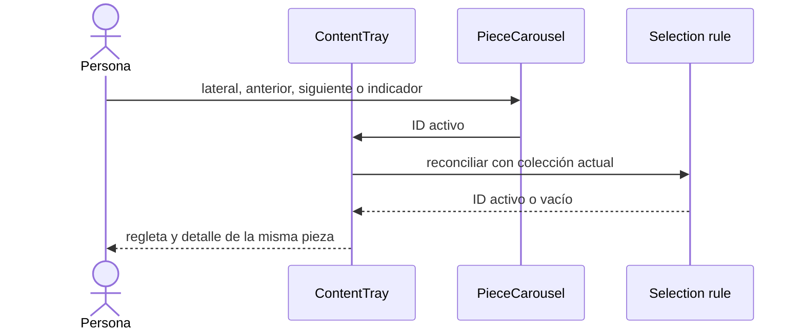
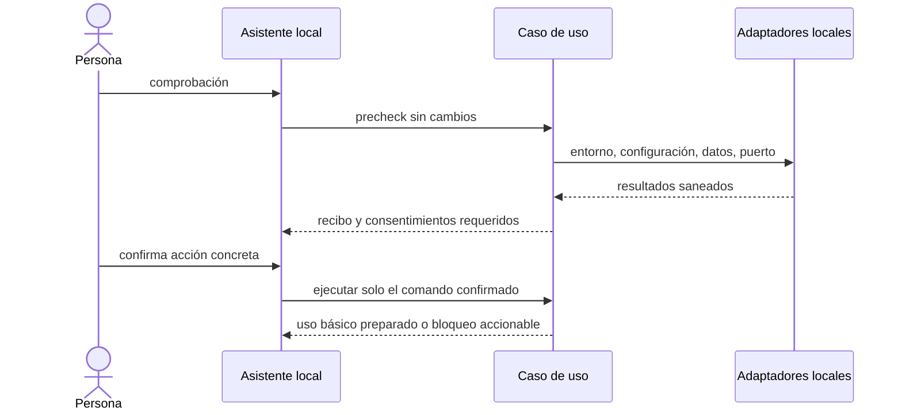

# Plan técnico · 001-content-tray-local-installation

| Campo | Valor |
|---|---|
| **Spec** | [`spec.md`](./spec.md) |
| **Estado** | `aprobado` |
| **Fecha** | 2026-08-21 |
| **Arquitectura vigente** | Monolito modular local con fronteras hexagonales parciales |
| **ADR relacionados** | `ADR-0001-arquitectura-heredada-monolito-modular-local` |
| **Gate de producto** | `legacy-pending` durable; no se presenta como verde |
| **Gate funcional** | `approved` por norkc, 2026-08-21 |
| **Gate de diseño** | `approved` por norkc, 2026-08-21 |

## 1. Resumen de la solución

`ContentTray` será la única fuente de la pieza activa y derivará el índice controlado que consume
`Carousel3D` a través de `PieceCarousel`; el detalle usará ese mismo ID. Una regla pura resolverá
la sustitución siguiente/anterior o el vacío cuando cambie la colección. La lista mantendrá su mapa
por pieza durante la sesión, pero lo reiniciará plegado al cargar una colección nueva.

Un asistente interno de consola para Windows 11 comprobará primero sin cambios Node/npm, la plantilla
de configuración, SQLite/Prisma, el puerto y las capacidades opcionales. Solo preparará dependencias,
`.env`, SQLite, procesos o caché tras mostrar el ámbito y obtener el consentimiento exigido; los datos
locales existentes se bloquean y preservan hasta un reset separado confirmado. README documentará el
mismo contrato sin imprimir secretos ni rutas personales.

### Trazabilidad

| OBJ | PRD-RF | UC | RF | CA | Componente previsto | Test previsto |
|---|---|---|---|---|---|---|
| OBJ-005 | PRD-RF-007 | UC-010 | RF-01 | CA-01 | selección controlada de bandeja/carrusel | selector puro + UI |
| OBJ-005 | PRD-RF-007 | UC-010 | RF-02 | CA-02 | reconciliación de colección | unitario |
| OBJ-005 | PRD-RF-012 | UC-010 | RF-03 | CA-03 | estado de lista por pieza | UI |
| OBJ-004 | PRD-RF-005 | UC-011 | RF-04 | CA-04 | README + preparación Prisma | CLI/manual |
| OBJ-004 | PRD-RF-006 | UC-012 | RF-05 | CA-05 | precheck, consentimiento y reset | unitario/CLI |
| OBJ-004 | PRD-RF-008 | UC-011 | RF-06 | CA-06 | clasificación de opcionales | unitario/README |
| OBJ-004 | PRD-RF-006 | UC-012 | RF-07 | CA-07 | diagnósticos redaccion segura | unitario/CLI |
| OBJ-004 | PRD-RF-006 | UC-012 | RF-08 | CA-08 | recibo repetible de preparación | unitario/CLI |

Fuentes: `SRC-001`, `SRC-002`, `SRC-009` a `SRC-016`. Discrepancias resueltas: `DISC-008`,
`DISC-009`, `DISC-010`. Abiertas: ninguna en producto/spec/diseño; permanece el riesgo de gobierno
durable indicado en la cabecera.

## 2. Aplicación de la arquitectura

| Capa | Qué se prevé |
|---|---|
| `domain/` | Regla pura de reconciliación de ID activo y tipos puros del resultado de precheck. |
| `application/` | Orquestación de comprobación, clasificación, consentimiento y resultado final sin exponer detalles locales. |
| `infrastructure/` | Adaptadores de filesystem, procesos, Prisma y puerto; rutas contenidas, `shell:false` y sin lectura de `.env`. |
| `interfaces/` | `ContentTray`/`PieceCarousel` controlados, CLI lineal de Windows 11 y README como guía manual. |

Las dependencias siguen hacia dentro: componentes y CLI no acceden directamente a Prisma, datos o
procesos; los adaptadores devuelven resultados normalizados. No se modifica `ContentPiece`, la API
de contenido ni el esquema Prisma. No se requiere ADR.

## 3. Componentes previstos

| Componente | Cambio previsto | Riesgo de regresión |
|---|---|---|
| `src/core/content/selection.ts` | Nuevo módulo puro para elegir/conservar/reemplazar la pieza activa. | Política incorrecta tras borrado. |
| `src/components/ContentTray.tsx` | ID activo único, detalle sin fallback residual y reinicio de plegados al recargar. | SSE y acciones por pieza. |
| `src/components/PieceCarousel.tsx` | Propagar selección e índice controlados. | Previews y otros consumidores de `Carousel3D`. |
| `scripts/install-local.mjs` | Nuevo adaptador de consola. Gate aprobado el 2026-08-21. | Efectos locales y compatibilidad Windows. |
| `src/core/installation/*.mjs` | Tipos, casos de uso y adaptadores de preparación, en JavaScript ESM por §3.3. | Diagnóstico incorrecto o filtración. |
| `README.md` | Guía manual equivalente al contrato de instalación. | Deriva frente al CLI. |
| `package.json` | Registrar cada test nuevo en `test:contracts` (§3.2), añadir las devDependencies del runner de UI (§3.1) y el script `test:ui`. | **Verde falso** en `T-001-01` si solo se hace una de sus dos ediciones. |
| `vitest.config.ts` | Nuevo. Entorno `jsdom` y plugin de React para los tests de componente. | Ninguno en producción: no entra en el bundle. |

### 3.1 Dependencias nuevas

Esta spec **sí introduce dependencias**, todas de desarrollo y solo para poder demostrar el RED de
`T-001-06`. Aprobado por norkc el 2026-08-21. El detalle y las alternativas descartadas están en
[`research.md`](./research.md) §`D-RUNNER-UI`. La opción se pidió como «vitest +
@testing-library/react», pero su instalación real son cinco paquetes imprescindibles y uno opcional:

| Paquete | Papel | Imprescindible |
|---|---|---|
| `vitest` | Runner y aserciones. | Sí |
| `@vitejs/plugin-react` | Transforma TSX/JSX de React 19. | Sí |
| `jsdom` | DOM en Node. | Sí |
| `@testing-library/react` | Render y consultas accesibles por rol y nombre. | Sí |
| `@testing-library/user-event` | Teclado real para `UX-A11Y-003` y `UX-A11Y-005`. | Sí |
| `@testing-library/jest-dom` | Matchers de DOM. | Opcional |

`npm install -D …` debe ejecutarlo la persona en su máquina: el DNS externo no resuelve desde la shell
del agente (AGENTS.md §2). Es precondición **exclusiva de `T-001-06`**; el resto de tareas usa
`node --test`, ya disponible con Node ≥ 20, o es documentación.

### 3.2 Ediciones de `test:contracts`

`test:contracts` encadena `tsc` sobre una lista explícita de ficheros, `node --test` sobre una lista
explícita de globs y un borrado del directorio temporal. Como todas las entradas cuelgan de
`src/core/`, el `rootDir` inferido es `src/core` y `src/core/content/selection.test.ts` compila a
`.contract-tests/content/selection.test.js`. Hoy **no existe** un glob `.contract-tests/content/…`,
así que añadir solo el fuente y el test a `tsc` deja el test compilado pero nunca ejecutado.

| Tarea | Edición 1 — lista de `tsc` | Edición 2 — globs de `node --test` |
|---|---|---|
| `T-001-01` | `src/core/content/selection.ts` y `selection.test.ts` | `.contract-tests/content/*.test.js` |
| `T-001-02` a `T-001-04` | ninguna: son JavaScript, ver §3.3 | `src/core/installation/*.test.mjs` |
| `T-001-05` | ninguna: `scripts/install-local.test.mjs` no pasa por `tsc` | `scripts/install-local.test.mjs` |

Comprobación observable de que la edición está completa: el RED debe **fallar al ejecutarse**, no solo
compilar.

### 3.3 Runtime del asistente de consola

Detectado al trocear. `RF-04` y la operación `prepare` incluyen **preparar las dependencias**, así que
el asistente se ejecuta antes de que exista `node_modules`. Eso descarta compilar TypeScript como
puente: `typescript` es una `devDependency` y todavía no está instalada; `--experimental-strip-types`
exigiría Node ≥ 22.6 frente al `>=20` declarado en `engines`; y duplicar la lógica dentro del `.mjs`
rompería DRY.

`src/core/installation/*` se escribe por tanto en **JavaScript ESM con JSDoc**, sin dependencias y
ejecutable con Node ≥ 20 sobre un clon recién descargado. Los tipos del contrato ya están fijados en
[`contracts/internal-cli.md`](contracts/internal-cli.md). Justificación completa en
[`research.md`](./research.md) §`D-CLI-RUNTIME`.

## 4. Patrones de diseño aplicados

| Problema | Patrón | Alternativa descartada | Justificación |
|---|---|---|---|
| Carrusel y detalle divergen por dos estados. | Estado controlado con fuente única de verdad. | Mantener el índice interno y emitir solo al activar el centro. | `Carousel3D` ya acepta `active`/`onActive`; evita otra vía de divergencia. |
| Una activa desaparece durante revisión. | Función pura de reconciliación. | Fallback visual a `pieces[0]`. | Hace explícita la prioridad siguiente, anterior, vacío y permite pruebas sin UI. |
| Prechecks, consentimientos y acciones mezclan reglas con SO. | Ports and adapters pragmático. | CLI monolítica que llama Node/Prisma directamente. | Conserva reglas testeables y encapsula filesystem, procesos y Prisma. |
| Efectos locales con distinto riesgo. | Command/Result tipado. | Booleanos y mensajes ad hoc. | Cada paso declara categoría, efecto, consentimiento y siguiente paso sin revelar datos. |
| Herramientas opcionales no deben bloquear. | Clasificación explícita de capacidades. | Tratar toda ausencia como error. | Separa bloqueo obligatorio, opcional bloqueada y opcional degradada. |

## 5. Flujos





## 6. Datos y migración

Ver [data-model.md](./data-model.md). No hay migración Prisma: la selección y el plegado son estado
de presentación. La preparación SQLite solo crea o sincroniza una base de clonación limpia tras
precheck; cualquier archivo SQLite o sidecar existente se clasifica protegido y bloquea hasta una
solicitud de reset confirmada por separado.

## 7. Contratos

Ver [contracts/internal-cli.md](contracts/internal-cli.md). No hay cambio HTTP ni contrato público.
El CLI es interno, versión `1`, y devuelve resultados JSON saneados o texto lineal equivalente.

### 7.1 Regla de selección

El comportamiento observable lo fija [`design.md`](./design.md), no `data-model.md`.
`data-model.md` modela el **valor** resultante; `design.md` exige además **tres microcopys
distinguibles** para la misma transición: revisión normal (línea 144), «La pieza que revisabas ya no
está disponible. Se ha abierto [título vecina].» (líneas 125-127) y «La colección ya no tiene piezas»
(línea 157). Si la regla devolviera solo `string | null`, la interfaz tendría que deducir cuál de los
tres casos ocurrió comparando con el estado anterior: sería una segunda fuente de verdad, el defecto
que esta spec corrige. Por eso valor y desenlace viajan juntos:

```ts
type Reconciliation =
  | { pieceId: string; outcome: "kept" }
  | { pieceId: string; outcome: "replaced" }
  | { pieceId: null; outcome: "empty" };

function reconcileActivePiece(
  previousId: string | null,
  previousIndex: number,
  pieceIds: readonly string[],
): Reconciliation;
```

Prioridad: conservar el ID si sigue presente; si no, la vecina siguiente; si no existe, la anterior;
si no queda ninguna, vacío. `previousIndex` es necesario porque, desaparecido el ID, la posición que
ocupaba es la única vía para localizar a su vecina.

## 8. Estrategia de test

Ver [test-plan.md](./test-plan.md) y [tasks.md](./tasks.md). Siete tareas, ordenadas de domain a
interfaces: `T-001-01` a `T-001-07`. Los módulos de reglas puras son CORE; los adaptadores locales,
INFRASTRUCTURE; la interfaz de bandeja, IMPORTANT.

### 8.1 Runners

| Superficie | Runner | Comando | Dependencia nueva |
|---|---|---|---|
| Regla de selección (`src/core/content/selection.ts`) | `node --test` sobre la salida de `tsc` | `npm run test:contracts` | Ninguna |
| Núcleo de instalación (`src/core/installation/*.mjs`) | `node --test` directo, sin compilar (§3.3) | `npm run test:contracts` | Ninguna |
| CLI (`scripts/install-local.test.mjs`) | `node --test` directo | `npm run test:contracts` | Ninguna |
| Componentes (`ContentTray`, `PieceCarousel`) | Vitest + Testing Library en `jsdom` | `npm run test:ui` | Sí, ver §3.1 |
| Contraste real y área de controles con zoom | Revisión manual | `/sdd-verify` (`code-reviewer`) | No automatizable en `jsdom` |

`jsdom` no calcula layout ni resuelve variables CSS, así que `UX-A11Y-001` y `UX-A11Y-004` solo quedan
cubiertos automáticamente en su parte semántica; la medición es manual y se registra como tal. No se
declara verde lo que no se ha medido.

## 9. Seguridad

Impacto: `sensible`. Marco: OWASP Top 10:2025 y ASVS 5.0.0 L2. No hay autenticación, roles,
proveedores ni secretos en alcance; sí filesystem, configuración y procesos locales.

| Control | ASVS | OWASP | Aplica | Decisión / justificación | Tarea | Test | Evidencia |
|---|---|---|---|---|---|---|---|
| SEC-INPUT-001 | ASVS 5.0.0 V5 validación | A05:2025 Injection | sí | Validar argumentos, plataforma y rutas bajo la raíz; no leer `.env`. | T-001-02 | `installation.test.mjs::debe_rechazar_ruta_fuera_del_proyecto` | `evidence.md#SEC-INPUT-001` |
| SEC-DATA-002 | ASVS 5.0.0 V8 datos; V12 ficheros | A04:2025 Cryptographic Failures | sí | DB y sidecars existentes se bloquean; reset requiere consentimiento separado y resguardo, nunca borrado automático. | T-001-03 | `installation.test.mjs::debe_bloquear_datos_existentes_sin_reset_confirmado` | `evidence.md#SEC-DATA-002` |
| SEC-PROC-003 | ASVS 5.0.0 V14 configuración segura | A02:2025 Security Misconfiguration | sí | Procesos con argv y `shell:false`; no se termina por imagen global, solo PID/puerto confirmado. | T-001-04 | `install-local.test.mjs::debe_requerir_confirmacion_por_pid` | `evidence.md#SEC-PROC-003` |
| SEC-DIAG-004 | ASVS 5.0.0 V7 errores/logs; V8 datos | A10:2025 Mishandling of Exceptional Conditions | sí | DTO de diagnósticos solo usa categoría, estado y recuperación; prohíbe valores, rutas personales y contenido local. | T-001-02 | `installation.test.mjs::debe_sanear_diagnostico_local` | `evidence.md#SEC-DIAG-004` |
| SEC-DEPS-005 | ASVS 5.0.0 V14 dependencias | A03:2025 Software Supply Chain Failures | sí | Dependencias se preparan con npm bajo consentimiento; no instala globalmente ni modifica PATH. | T-001-04 | `install-local.test.mjs::debe_clasificar_instalacion_global_como_efecto_externo` | `evidence.md#SEC-DEPS-005` |

> **Corrección de fidelidad posterior al gate, sin cambio de alcance.** Todo test nombrado en esta
> sección y en §9.1 como `installation.test.ts` se materializa como `installation.test.mjs` por la
> restricción de runtime de §3.3. Los nombres de caso (`::debe_…`) no cambian, de modo que la
> trazabilidad de cada `SEC-*` y `UX-*` a su test y evidencia se conserva íntegra.

Auditoría prevista: `/security-scan plan` antes de aprobar y `/security-scan verify` al entregar;
`security-auditor` permanece solo lectura. La SCA no está configurada: se registrará como no
ejecutada con riesgo y siguiente paso, no como verde.

### 9.1 Usabilidad

| Control | WCAG 2.2 | Heurística | Aplica | Decisión / justificación | Tarea | Test | Evidencia |
|---|---|---|---|---|---|---|---|
| UX-A11Y-001 | WCAG 2.2 · 1.4.3, 1.4.11 | H8 | sí | Medir contraste final de texto, foco y controles. | T-001-06 | `ContentTray.test.tsx::debe_mantener_contraste_y_estado_activo` | `evidence.md#UX-A11Y-001` |
| UX-A11Y-002 | WCAG 2.2 · 1.4.1 | H1 | sí | Estado con texto/icono/etiqueta además de color. | T-001-06 | `ContentTray.test.tsx::debe_exponer_estado_activo_en_texto` | `evidence.md#UX-A11Y-002` |
| UX-A11Y-003 | WCAG 2.2 · 2.4.7, 2.4.3 | H3 | sí | Foco visible y orden tras seleccionar o plegar. | T-001-06 | `ContentTray.test.tsx::debe_conservar_foco_del_control_activado` | `evidence.md#UX-A11Y-003` |
| UX-A11Y-004 | WCAG 2.2 · 2.5.8 | H8 | sí | Controles de carrusel y lista con área suficiente en zoom/estrecho. | T-001-06 | `ContentTray.test.tsx::debe_mantener_controles_accesibles` | `evidence.md#UX-A11Y-004` |
| UX-A11Y-005 | WCAG 2.2 · 4.1.2 | H1 | sí | Nombre, posición, activo y expandido accesibles. | T-001-06 | `PieceCarousel.test.tsx::debe_nombrar_indicador_y_pieza_activa` | `evidence.md#UX-A11Y-005` |
| UX-A11Y-006 | WCAG 2.2 · 4.1.3 | H1 | sí | Anuncio educado para selección y asertivo solo para bloqueo. | T-001-06 | `ContentTray.test.tsx::debe_anunciar_detalle_actualizado` | `evidence.md#UX-A11Y-006` |
| UX-A11Y-007 | WCAG 2.2 · 2.3.3 | H8 | sí | Alternativa estable con movimiento reducido. | T-001-06 | `PieceCarousel.test.tsx::debe_conservar_seleccion_sin_movimiento` | `evidence.md#UX-A11Y-007` |
| UX-FORM-001 | 3.3.2, 3.3.4 | H5 | sí | Consentimiento visible, separado y no afirmativo por defecto. | T-001-05 | `install-local.test.mjs::debe_exigir_confirmacion_separada_para_reset` | `evidence.md#UX-FORM-001` |
| UX-COPY-001 | 3.3.1, 3.3.3 | H9 | sí | Diagnóstico: categoría, recuperación y alternativa sin datos locales. | T-001-03 | `installation.test.mjs::debe_devolver_recuperacion_segura` | `evidence.md#UX-COPY-001` |
| UX-PERF-001 | n/a | H1 | sí | Selección local p95 <100 ms; carga larga comunica progreso y salida segura. | T-001-06 | `ContentTray.test.tsx::debe_actualizar_detalle_en_una_activacion` | `evidence.md#UX-PERF-001` |

No hay actualización optimista para eliminación, reset, procesos o caché. La selección local es
inmediata porque no persiste; un error de recurso se comunica como parcial/error, nunca mostrando
otro detalle.

## 10. Documentación

| DOC-ID | Superficie | Aplica / motivo | Fuente de verdad | Artefacto | Generado / manual | Propietario | Tarea | Gate / comprobación | Evidencia |
|---|---|---|---|---|---|---|---|---|---|
| DOC-README-INSTALACION | developer-readme | sí; RF-04, RF-06 y RF-07 | spec, contrato CLI y `.env.example` | `README.md` | manual | docs-writer | T-001-07 | `node scripts/check-sdd.mjs --spec 001 --json`; revisión de clonación limpia | `evidence.md#DOC-README-INSTALACION` |

`.sdd/docs.json` está en modo `audit`; esta matriz no afirma aprobación documental. La tarea futura
de documentación actualizará el artefacto y registrará toda comprobación disponible.

## 11. Observabilidad y rendimiento

El CLI emitirá un recibo por categoría: obligatorio comprobado, obligatorio bloqueado u opcional
limitada. No incluirá valores de entorno, rutas personales, secretos, contenido de SQLite ni salida
cruda de procesos. La salud se deduce del resultado final y de cada paso, no de un proceso que siga
vivo. Para UI, la métrica relevante es la actualización local de selección en menos de 100 ms.

## 12. Despliegue y reversión

No hay feature flag ni despliegue remoto. La reversión de UI consiste en revertir el cambio de
presentación, sin datos migrados. El reset de instalación no se revierte automáticamente: la
implementación conservará el conjunto SQLite protegido como resguardo y el recibo indicará que la
persona debe restaurarlo manualmente si cancela o revierte el arranque.

## 13. Riesgos

| Riesgo | Mitigación |
|---|---|
| Se mata un proceso ajeno o se borra caché útil. | Precheck sin efectos, PID/puerto concreto y consentimiento explícito; nunca `/IM node.exe`. |
| Se pierde o expone SQLite existente. | Bloqueo conservador, diagnóstico saneado, reset separado confirmado y resguardo. |
| README y CLI divergen. | Mismo contrato interno, tarea documental posterior a estabilizar CLI y revisión de clonación. |
| El detalle queda desincronizado tras SSE o borrado. | ID activo único y reconciliación pura ante cada colección cargada. |
| Gates no configurados se interpretan como aprobación. | Evidencia declara controles no ejecutados; solo `sdd` está disponible hoy. |
| Un test nuevo compila pero nadie lo ejecuta. | `test:contracts` exige dos ediciones (§3.2); el RED debe fallar **al ejecutarse**, no solo compilar. |
| El contraste se declara verde porque `jsdom` no falla. | `UX-A11Y-001` y `UX-A11Y-004` se miden a mano en `/sdd-verify` y se registran como control manual (§8.1). |

## 14. Conformidad con la constitución

- [x] Respeta las reglas de dependencia y los adaptadores locales.
- [x] No introduce arquitectura ni almacenamiento nuevos; no requiere ADR.
- [x] **Sí introduce dependencias nuevas, y solo de desarrollo.** Cinco devDependencies
  imprescindibles y una opcional para el runner de UI (§3.1), justificadas en
  [`research.md`](./research.md) §`D-RUNNER-UI` y aprobadas por norkc el 2026-08-21. Ninguna entra en
  el bundle de producción. La casilla anterior afirmaba lo contrario y era incorrecta.
- [x] Cada RF y CA tiene componente y test previsto.
- [x] Cada patrón parte de un problema observado.
- [x] Aplica YAGNI: no gestiona secretos, proveedores, instalación global ni publicación.

## 15. Gate humano del plan técnico

| Campo | Valor |
|---|---|
| **Estado** | `approved` |
| **Persona** | norkc |
| **Fecha** | 2026-08-21 |
| **Alcance aprobado** | Regla pura de selección en `src/core/content/selection.ts`; `ContentTray` y `PieceCarousel` como componentes controlados con una única identidad activa; CLI interno `scripts/install-local.mjs` sobre `src/core/installation/*`; sin migración Prisma. |
| **Condiciones / riesgos aceptados** | El baseline de producto (PRD) permanece en `legacy-pending`. norkc lo acepta expresamente como riesgo durable: **no se presenta como verde** y deberá resolverse en su propio circuito. |
| **Aprobación posterior** | Añadir el runner de pruebas de UI (Vitest + Testing Library y sus dependencias asociadas) como devDependencies, para cubrir `T-001-06` con TDD real. Aprobado por norkc el 2026-08-21 con el coste de §3.1 a la vista. |

Gate aprobado: `tasks.md` existe. Ver [tasks.md](./tasks.md).
