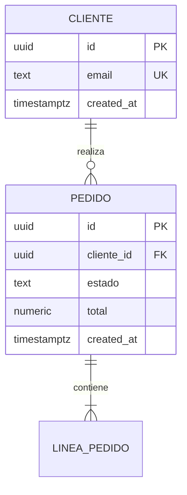

# Modelo de datos · NNN-slug

---

## Diagrama

## Entidades

### `<nombre>`

| Campo | Tipo | Nulo | Restricción | Notas |
|---|---|---|---|---|
| `id` | uuid v7 | no | PK | |
| | | | | |

**Invariantes** (deben cumplirse siempre, protegidas en el agregado *y* en la base):
- <invariante>

**Índices**:
| Índice | Columnas | Motivo (patrón de acceso real) |
|---|---|---|
| | | |

> Cada índice cuesta en escritura. Sin patrón de acceso real que lo justifique, no se crea.

## Relaciones

| Origen | Destino | Cardinalidad | `ON DELETE` | Motivo |
|---|---|---|---|---|
| | | | | |

## Migraciones

| Nº | Qué hace | Reversible | Bloquea | Duración estimada |
|---|---|---|---|---|
| `NNNN_...` | | sí/no | sí/no | |

**Estrategia** (expand → migrate → contract):
1. <añadir columna nullable, código escribe en ambas>
2. <backfill por lotes, idempotente y reanudable>
3. <cambiar lecturas, eliminar lo viejo en migración posterior>

**Impacto en datos existentes**: <cuántas filas, cuánto tarda, qué pasa si falla a medias>

**Reversión**: <cómo se deshace, y qué se pierde>

## Datos personales y retención

| Campo | ¿PII? | Base legal | Retención | Borrado |
|---|---|---|---|---|
| | | | | |

## Tests de datos

- [ ] Test de subida y bajada de cada migración
- [ ] Test que intenta violar cada `CHECK`, `UNIQUE` y FK y comprueba que la base lo impide
- [ ] Test de RLS: acceder como otro tenant **debe fallar**
- [ ] `EXPLAIN ANALYZE` de las consultas críticas, con el plan pegado
