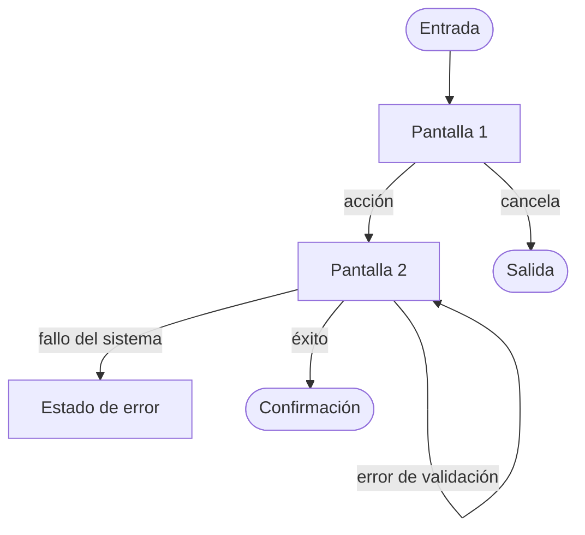

# NNN · Diseño — <Título de la funcionalidad>

| Campo | Valor |
|---|---|
| **Spec** | [`spec.md`](./spec.md) |
| **Estado** | borrador \| en revisión \| aprobado |
| **Autor** | |
| **Fecha** | YYYY-MM-DD |
| **Diseño de referencia** | <enlace Figma/Stitch con el nodo exacto, o "ninguno"> |
| **Fuentes de intake** | `<SRC-... / ninguna>` |
| **Discrepancias relacionadas** | `<DISC-... / ninguna>` |

> ⚠️ Este documento describe **cómo se ve y cómo se recorre**. Sin decisiones técnicas: ni
> framework, ni librería de componentes, ni estructura de carpetas. Eso va en `plan.md`.
>
> Se rellena en `/sdd-design`. Si la funcionalidad no tiene interfaz, esta fase se salta y se
> escribe aquí por qué.

---

## 0. Conformidad con la dirección visual

> Vinculante: [`docs/design/DIRECCION-VISUAL.md`](../../design/DIRECCION-VISUAL.md).
> Si no está aprobada, esta fase **no continúa**.

| Comprobación | Estado |
|---|---|
| Dirección visual aprobada por el usuario | sí / no — fecha |
| Escala tipográfica respetada (con contraste real, no solo tamaños) | |
| Paleta y roles de color respetados | |
| Densidad coherente con la declarada | |
| Cada pantalla tiene su **elemento con carácter** | |

**Desviaciones acordadas** — una desviación no es un detalle de estilo, es una decisión de
producto: se acuerda con el usuario y se anota.

| Qué se desvía | Por qué | ¿Quién lo aprobó? |
|---|---|---|
| | | |

## 1. Flujo de usuario

> Camino completo, **con los errores**. Un flujo que solo dibuja el camino feliz es una demo.



Flujo detallado: [`docs/design/flows/NNN-<flujo>.md`](../../design/flows/)

| Paso | Pantalla | Qué decide el usuario | Puede volver atrás |
|---|---|---|---|
| 1 | | | sí / no — por qué |

## 2. Pantallas y sus estados

> **Obligatorio: los seis estados por pantalla.** Es la mitad del diseño y lo que más se olvida.

### Pantalla 1 — <nombre> *(cubre CA-01, CA-02)*

| Estado | Qué se ve | Qué puede hacer el usuario |
|---|---|---|
| Vacío | | |
| Cargando | | |
| Parcial | | |
| Error | | |
| Sin permiso | | |
| Éxito | | |

**Elemento con carácter** *(obligatorio, uno por pantalla)*:

| Cuál | Por qué encaja con la personalidad declarada |
|---|---|
| | |

> No tiene que ser decorativo: un dato bien presentado tiene más carácter que una ilustración.
> Lo que no vale es "la tarjeta estándar": eso es ausencia de decisión, y produce el MVP de
> cuatro cajas.

Wireframe de baja fidelidad:

```
┌──────────────────────────────┐
│                              │
└──────────────────────────────┘
```

## 3. Componentes

| Componente | Reutiliza / Extiende / Nuevo | Justificación si es nuevo |
|---|---|---|
| | | |

> Un componente nuevo es coste permanente de mantenimiento. Se justifica o se reutiliza.

### Inconsistencias con el design system

| Valor usado en el diseño | Token que debería usar | Decisión |
|---|---|---|
| | | |

> Un valor fuera de los tokens se señala, no se codifica a pelo. Por ahí se desintegra un design
> system.

## 4. Contenido y microcopy

| Sitio | Texto | Nota |
|---|---|---|
| Botón principal | | **Verbo + sustantivo** de la acción real: "Guardar cambios", no "Aceptar" |
| Estado de carga | | Contextual: "Aplicando descuento…", no "Cargando…" |
| Estado vacío | | Debe enseñar el siguiente paso, con acción concreta |
| Error de validación | | **Qué está mal → cómo se arregla → alternativa.** Sin culpar: "la fecha debe ser posterior a hoy", no "has puesto mal la fecha" |
| Confirmación de éxito | | Específica: "Pedido realizado, confirmación enviada", no "Éxito" |

## 5. Responsive

| Ancho | Qué cambia |
|---|---|
| Móvil | |
| Tablet | |
| Escritorio | |

Qué se degrada o se oculta en pantalla estrecha, y por qué **eso** y no otra cosa.

## 6. Accesibilidad — WCAG 2.2 AA verificada sobre el diseño

Criterio completo en [`docs/design/A11Y-CHECKLIST.md`](../../design/A11Y-CHECKLIST.md). Con
`Impacto de usabilidad = aplicable`, esta tabla **no puede quedarse con marcadores**: cada fila
lleva estado, y lo que resulte aplicable se declara como `UX-A11Y-NNN` en `plan.md` §9.3.

> `Estado`: `verificado` · `no ejecutado` · `no aplica` con motivo material.

| Comprobación | Estado | Nota | Control |
|---|---|---|---|
| Contraste ≥ 4.5:1 (≥ 3:1 grande y controles) | | | `<UX-A11Y-NNN / no aplica>` |
| Nada comunicado solo por color | | | |
| Foco visible diseñado | | | |
| Objetivos táctiles ≥ 24×24 px con separación | | | |
| Orden de tabulación pensado y coincidente con el visual | | | |
| Jerarquía de encabezados coherente | | | |
| Errores concretos y asociados a su campo | | | |
| Nombre accesible en controles de solo icono | | | |
| Alternativa para `prefers-reduced-motion` | | | |

## 6 bis. Usabilidad

La accesibilidad es el suelo legal; esto es lo que hace que además se entienda. Checklist completo
en [`docs/design/USABILITY-CHECKLIST.md`](../../design/USABILITY-CHECKLIST.md).

| Comprobación | Estado | Nota | Control |
|---|---|---|---|
| Diez heurísticas recorridas | | | `<UX-*-NNN / no aplica>` |
| Formularios: etiqueta visible, tipo semántico, validación al salir del campo | | | |
| Mensajes de error: qué está mal → cómo se arregla | | | |
| Microcopy: botones con verbo + sustantivo; estados vacíos con salida | | | |
| Toda acción responde en menos de 100 ms | | | |
| Esqueleto con la forma del contenido real mientras carga | | | |

**Actualización optimista** — dónde se usa y, sobre todo, dónde **no**:

| Acción | ¿Optimista? | Reversión escrita | Por qué |
|---|---|---|---|
| `<acción reversible>` | Sí | `<cómo se restaura el estado exacto>` | Fácil de revertir, fallo raro |
| `<pago / alta / borrado>` | **No** | — | Espera confirmación real; el usuario debe poder afirmar que ocurrió |

## 7. Requisitos descubiertos en el diseño

> El diseño casi siempre descubre requisitos que la spec no vio. **No se meten aquí de tapadillo:
> vuelven a `/sdd-specify`.**

| Qué apareció | Impacto | ¿Vuelve a la spec? |
|---|---|---|
| | | |

## 8. Trazabilidad

| OBJ | PRD-RF | UC | RF | CA | Pantalla / paso que lo cubre |
|---|---|---|---|---|---|
| OBJ-001 | PRD-RF-001 | UC-001 | RF-01 | CA-01 | |

> Cada `CA` necesita recorrido; cada pantalla, un `CA` que la justifique. Una pantalla que no
> responde a ningún criterio es alcance que nadie pidió.

## 9. Preguntas abiertas

- `[NEEDS CLARIFICATION: <pregunta>]`

> Con marcadores aquí, `/sdd-plan` no arranca.

## 10. Gate humano de diseño

| Campo | Valor |
|---|---|
| **Estado** | `pending` \| `approved` \| `rejected` \| `skipped-no-ui` |
| **Persona** | `<quién aprueba u omite>` |
| **Fecha** | `<YYYY-MM-DD>` |
| **Alcance** | `<pantallas, flujos y discrepancias cubiertas>` |
| **Condiciones** | `<ninguna / lista>` |

> `/sdd-plan` solo continúa con `approved` o con `skipped-no-ui` justificado. Una fuente de diseño
> inaccesible queda en `SOURCES.md`; no se interpreta como aprobación ni como ausencia implícita.
