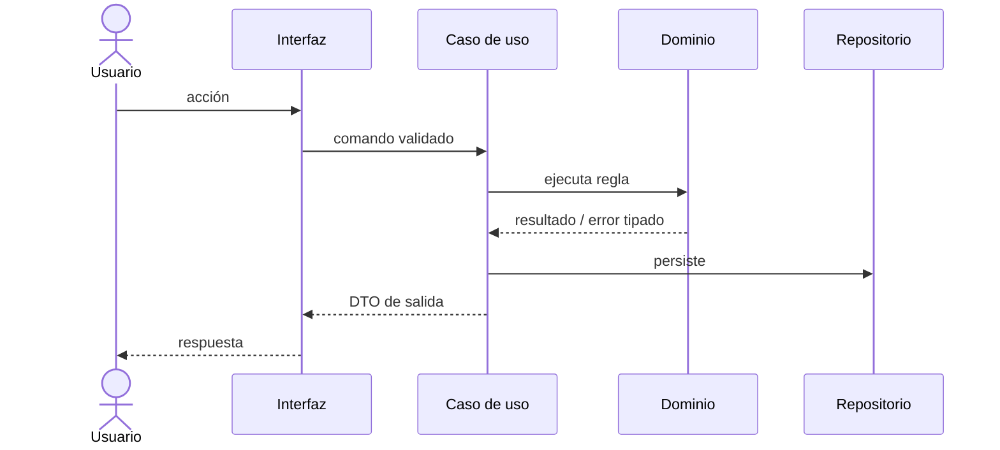

# Plan técnico · NNN-slug

| Campo | Valor |
|---|---|
| **Spec** | [`spec.md`](./spec.md) |
| **Estado** | borrador \| aprobado |
| **Fecha** | YYYY-MM-DD |
| **Arquitectura vigente** | <de `docs/architecture/constitution.md`> |
| **ADR relacionados** | |
| **Gate de producto** | `<approved/legacy-pending>` · `docs/product/PRD.md` |
| **Gate funcional** | `<approved>` · [`spec.md`](./spec.md) |
| **Gate de diseño** | `<approved/skipped-no-ui>` · [`design.md`](./design.md) |

---

## 1. Resumen de la solución

<5 líneas. Si no cabe en 5 líneas, la solución es demasiado compleja o no está clara.>

### Trazabilidad y fuentes de entrada

| OBJ | PRD-RF | UC | RF | CA | Componente previsto | Test previsto |
|---|---|---|---|---|---|---|
| OBJ-001 | PRD-RF-001 | UC-001 | RF-01 | CA-01 | `<componente>` | `<test>` |

- Fuentes consideradas: `<SRC-...>`.
- Discrepancias resueltas: `<DISC-... / ninguna>`.
- Discrepancias abiertas: `<0 para aprobar>`.

## 2. Aplicación de la arquitectura

| Capa | Qué se añade aquí |
|---|---|
| `domain/` | |
| `application/` | |
| `infrastructure/` | |
| `interfaces/` | |

**Reglas de dependencia respetadas**: sí / no (si no, ADR requerido).

## 3. Componentes

### Nuevos
| Componente | Responsabilidad (una sola) | Ruta prevista |
|---|---|---|
| | | |

### Modificados
| Componente | Qué cambia | Riesgo de regresión |
|---|---|---|
| | | |

## 4. Patrones de diseño aplicados

> Cada patrón necesita un problema real detrás. Si no puedes nombrar el problema, quita el patrón.

| Problema | Patrón | Alternativa descartada | Por qué |
|---|---|---|---|
| | | | |

## 5. Flujo principal

## 6. Modelo de datos

Ver [`data-model.md`](./data-model.md).
Resumen de cambios de esquema y estrategia de migración: <…>

## 7. Contratos

Ver [`contracts/`](./contracts/).
¿Cambios rompedores? <sí/no> · Versionado: <…>

## 8. Estrategia de test

Ver [`test-plan.md`](./test-plan.md).

| Nivel | Qué se prueba aquí |
|---|---|
| Unitario | |
| Integración | |
| Contrato | |
| E2E | |

### 8.1 · Calibración de verificación

**Tier de cobertura por módulo.** Lo que no se declare aquí se exigirá al **100 %**: el defecto es
el estricto a propósito, porque clasificar cuesta menos que justificar después por qué un módulo
sin clasificar está al 40 %.

| Módulo / ruta | Tier | Por qué |
|---|---|---|
| `<ruta>` | CORE \| IMPORTANT \| INFRASTRUCTURE | `<maneja dinero / lo ve el usuario / lo valida el compilador>` |

Criterio en [`TEST-STRATEGY.md`](../../quality/TEST-STRATEGY.md) §8. Ningún módulo que maneje
dinero, datos críticos o permisos puede quedar por debajo de CORE, y `/sdd-verify` lo comprueba.

**Profundidad, cuando no es obvia.** Las cuatro preguntas de §0 —comportamiento conocido, coste de
fallar, estabilidad del requisito, simulabilidad—:

| Componente | Respuesta | Decisión |
|---|---|---|
| `<componente>` | `<n>` de 4 hacia verificar | `<suite exhaustiva / camino feliz + instrumentación>` |

Calibra cuántos casos límite, si hay E2E y si se mide mutation score. **No** calibra si hay ciclo
rojo-verde: eso no se negocia.

## 9. Seguridad

**Impacto de seguridad heredado de `spec.md`**: `sensible | no-sensible | security-pending`.

Marco: **OWASP Top 10:2025** (riesgos) y **ASVS 5.0.0** nivel `<L1/L2/L3>` (requisitos
verificables). Consulta [`AUTH-TOKENS.md`](../../security/AUTH-TOKENS.md) solo si el proyecto elige
JWT o credenciales de navegador; JWT no es el valor por defecto.

| Aspecto | Decisión dependiente del stack |
|---|---|
| HTTPS y headers de seguridad | `<control, capa y test; no imponer una librería>` |
| Entradas externas y validación | `<esquema en cada frontera>` |
| Inyección y queries parametrizadas | `<adaptador y prueba negativa>` |
| Autorización (quién puede, comprobado dónde) | `<caso de uso/servidor>` |
| Rate limiting, límites e idempotencia | `<fronteras y política>` |
| CSRF, CORS, cookies y almacenamiento | `<según transporte>` |
| XSS, sanitización y CSP | `<según interfaz>` |
| Secretos, dependencias y supply chain | `<gestión y comandos reales>` |
| Datos sensibles y su tratamiento | `<minimización, retención, borrado, logs>` |
| Amenazas y casos de abuso | `<threat model y test-plan>` |

### 9.1 · Matriz de controles

> Una fila por control. `Aplica = no` exige una justificación material. Si aplica, ninguna celda
> desde decisión hasta evidencia puede quedar vacía o con marcador.

| Control | ASVS | OWASP | Aplica | Decisión / justificación | Tarea | Test | Evidencia |
|---|---|---|---|---|---|---|---|
| SEC-<ID> | ASVS 5.0.0 Vx | A0x:2025 | `<sí/no>` | `<decisión o motivo material>` | T-NNN-XX | `<ruta::caso>` | `evidence.md#T-NNN-XX` |

### 9.2 · Auditoría prevista

- Skill: `/security-scan` con alcance `plan`, `verify` o `complete` según la fase.
- Auditor: `security-auditor` en solo lectura; devuelve un HANDOFF, no escribe el informe.
- Escritor autorizado: `docs-writer`, que materializa literalmente el handoff sin reinterpretarlo.
- Informe: `docs/security/reports/YYYY-MM-DD-NNN-slug.md` con
  `<!-- sdd-security-report:v1 -->` y JSON canónico.

### 9.3 · Matriz de controles de usabilidad

**Impacto de usabilidad heredado de `spec.md`**: `aplicable | sin-ui · motivo | ux-pending`.

Marco: **WCAG 2.2 AA** ([`A11Y-CHECKLIST.md`](../../design/A11Y-CHECKLIST.md)) y las **diez
heurísticas** ([`USABILITY-CHECKLIST.md`](../../design/USABILITY-CHECKLIST.md)).

> Una fila por control. ID `UX-<AREA>-NNN` con área `A11Y`, `FORM`, `COPY` o `PERF`.
> `Aplica = no` exige una justificación material. Si aplica, ninguna celda desde decisión hasta
> evidencia puede quedar vacía o con marcador.

| Control | WCAG 2.2 | Heurística | Aplica | Decisión / justificación | Tarea | Test | Evidencia |
|---|---|---|---|---|---|---|---|
| UX-A11Y-001 | `<criterio o n/a>` | `<H1…H10 o n/a>` | `<sí/no>` | `<decisión o motivo material>` | T-NNN-XX | `<ruta::caso>` | `evidence.md#UX-A11Y-001` |
| UX-FORM-001 | `<criterio o n/a>` | `<H1…H10 o n/a>` | `<sí/no>` | `<decisión o motivo material>` | T-NNN-XX | `<ruta::caso>` | `evidence.md#UX-FORM-001` |
| UX-COPY-001 | `<criterio o n/a>` | `<H1…H10 o n/a>` | `<sí/no>` | `<decisión o motivo material>` | T-NNN-XX | `<ruta::caso>` | `evidence.md#UX-COPY-001` |
| UX-PERF-001 | `<criterio o n/a>` | `<H1…H10 o n/a>` | `<sí/no>` | `<decisión o motivo material>` | T-NNN-XX | `<ruta::caso>` | `evidence.md#UX-PERF-001` |

**Umbrales de velocidad percibida** que fija esta spec, si `PERF` aplica:

| Espera | Qué se muestra | Objetivo |
|---|---|---|
| < 100 ms | Nada; cambio de estado inmediato del elemento pulsado | Toda interacción |
| 100 ms – 1 s | Estado visible en el propio control | |
| 1 – 3 s | Indicador de progreso | |
| > 3 s | Progreso con estimación y opción de cancelar | |

**Actualización optimista** — dónde se usa y, sobre todo, dónde **no**:

| Acción | ¿Optimista? | Reversión escrita | Por qué |
|---|---|---|---|
| `<acción reversible>` | Sí | `<cómo se restaura el estado exacto>` | Fácil de revertir, fallo raro |
| `<pago / alta / borrado>` | **No** | — | El usuario debe poder afirmar que ocurrió |

### 9.4 · Auditoría de usabilidad prevista

- Skill: `/sdd-verify` paso 5 bis, con alcance `verify`.
- Auditor: `code-reviewer` en solo lectura, con las dos checklists como criterio; devuelve un
  HANDOFF y no escribe el informe.
- Consultado en fase de diseño y de plan: `ux-designer`, que conserva su escritura en `/sdd-design`.
- Escritor autorizado: `docs-writer`, que materializa literalmente el handoff sin reinterpretarlo.
- Informe: `docs/design/reports/YYYY-MM-DD-NNN-slug.md` con
  `<!-- sdd-usability-report:v1 -->` y JSON canónico.
- Gate `a11y`: obligatorio si el impacto es `aplicable`. Sin herramienta en el proyecto, se declara
  como **control no ejecutado** con riesgo, propietario y siguiente paso. Nunca como "pasa".

## 10. Rendimiento

| Métrica | Objetivo | Cómo se consigue |
|---|---|---|
| | | |

Consultas críticas: <…> · Estrategia de caché e **invalidación**: <…>

## 10 bis. Documentación

**Impacto heredado de `spec.md`**: `aplicable · DOC-... | no-aplica · motivo | docs-pending`.

| DOC-ID | Superficie | Aplica / motivo | Fuente de verdad | Artefacto | Generado / manual | Propietario | Tarea | Gate / comprobación | Evidencia |
|---|---|---|---|---|---|---|---|---|---|
| DOC-... | `<kind de .sdd/docs.json>` | `<sí / motivo material>` | `<ruta o contrato>` | `<ruta versionable>` | `<generado/manual>` | `<agente>` | T-NNN-XX | `<docs:* o revisión verificable>` | `evidence.md#DOC-...` |

Un artefacto generado exige un gate documental real y lento. La fuente se versiona; el build
generado solo se versiona si `.sdd/docs.json` lo declara explícitamente.

## 11. Observabilidad

- Logs (eventos, campos, sin PII): <…>
- Métricas: <…>
- Trazas: <…>
- **Caminos que se instrumentan** y clases de error esperadas (red, negocio, recursos, terceros): <…>
- **Salud por versión**: qué indicadores se vigilan y qué combinación dispara la reversión: <…>
- **Eventos de negocio** del rastro, sin datos personales: <…>
- Alertas: umbral de aviso, umbral crítico y **playbook** de cada una: <…>

Procedimiento: [`/observability`](../../../.agents/skills/observability/SKILL.md).
Si esta spec introduce caminos que pueden fallar delante de un usuario, aquí sale una tarea con
terreno `observability`.

## 12. Despliegue

- Feature flag: `<nombre>` — se retira cuando <condición>
- Orden de despliegue: <…>
- Compatibilidad con la versión anterior: <…>

## 13. Riesgos y mitigaciones

| Riesgo | Mitigación |
|---|---|
| | |

## 14. Plan de reversión

<Comando exacto y tiempo estimado. Qué pasa con los datos ya migrados.>

## 15. Conformidad con la constitución

- [ ] Respeta las reglas de dependencia
- [ ] No introduce una arquitectura distinta sin ADR
- [ ] Cada RF de la spec tiene componente(s) que lo cubren
- [ ] Cada CA tiene un test previsto
- [ ] Cada patrón tiene un problema real detrás
- [ ] Nada implementado que la spec no pida (YAGNI)
- [ ] Toda dependencia nueva justificada en `research.md`

## 16. Gate humano del plan técnico

| Campo | Valor |
|---|---|
| **Estado** | `pending` \| `approved` \| `rejected` |
| **Persona** | `<quién decide>` |
| **Fecha** | `<YYYY-MM-DD>` |
| **Alcance aprobado** | `<componentes, contratos, datos y despliegue>` |
| **Condiciones / riesgos aceptados** | `<ninguno / lista>` |

> `/sdd-tasks` no comienza con este gate pendiente, con discrepancias abiertas o con un gate de
> producto, spec o diseño incompatible.
